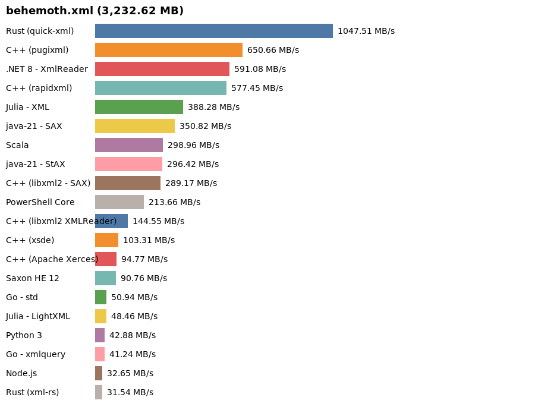

# xml-i

xml-i ("***XML eye***") is a personal playground project where I experiment with implementing a simple program in various programming languages (and libraries), focusing on efficiency and performance in each approach.

The cli of the program should look the same in each language, which would be something like this:

```
./<path_to_program> <path_to_xml_file> [node_name1 node_name2 ...]
```

* The program expects at least one argument: the path to the XML file.
* Additional arguments can be provided to specify node names to filter.

The program counts the occurrences of distinct XML nodes in a given XML document. A custom list of node names may also be passed if only a subset of all nodes should be counted. (see if that makes any difference in runtime/mem consumption...) 

A basic benchmarking feature is included to demonstrate and compare the performance differences between the language implementations.

- **Baseline implementation:** Written in [Rust](https://www.rust-lang.org/), using [quick-xml](https://docs.rs/quick-xml/latest/quick_xml/), serving as the primary reference for efficiency and performance.
- **Alternative implementations:** Code in other languages can be found in the [alien](./alien/) directory.

## Example Usage

```
./target/release/xml-i ./test/huge.xml boing blips
Node counts:
boing: 1342440
blips: 1279

./alien/bin/xml-i-xerces ./test/_/huge.xml boing blips
Node counts:
boing: 1342440
blips: 1279
```

## Build / TestData / Benchmarking

Each variant defines it's *b*uild*c*onfig via `New-AppDecl`.
All `<something>.bc.ps1` are automatically picked up and dot-sources by`xml-i.build.ps1`.
Use PowerShell and `Invoke-Build`.

See [the Rust quick-xml build config](src/main.bc.ps1) as example.

Basis for my [benchmark-results](test/benchmark_results.md):

* ***OS:*** Linux 6.something-MANJARO
* ***Model:*** ThinkPad X13 Laptop 
* ***CPU:*** 12th Gen Intel(R) Core(TM) i7-1270P
* ***RAM:*** 32GB 
* ***HDD:*** WD Black SN770 / PC SN740 256GB / PC SN560 (DRAM-less) NVMe SSD

=> [See benchmark_results.md](test/benchmark_results.md)




## Motivation

This repository serves as a learning and benchmarking tool, helping to explore language-specific approaches to XML processing and performance optimization.

## License

MIT License - see [LICENSE.txt](./LICENSE.txt)
