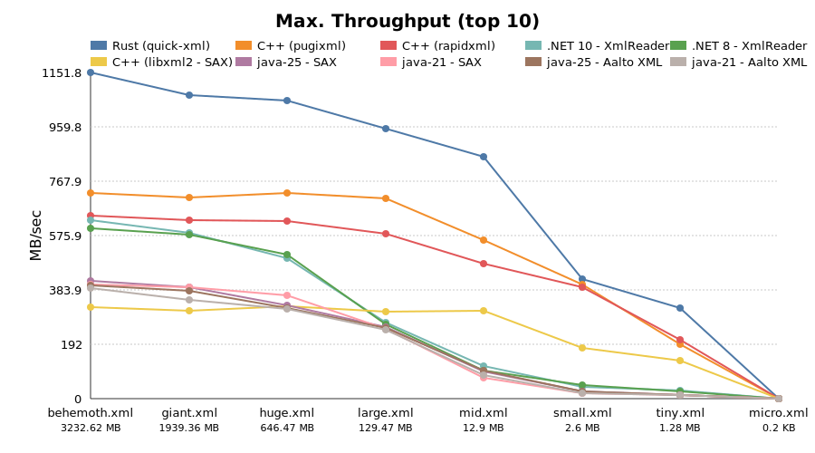

# Benchmark Results 06/10/2025 22:34:10

## System Information
```
Hostname: tpX13
Kernel: Linux 6.14.6-2-MANJARO x86_64 GNU/Linux
Distro: Manjaro Linux
CPU: 12th Gen Intel(R) Core(TM) i7-1270P
Disk: WD PC SN740 SDDQNQD-512G-1201
Memory: 31Gi
```

## Overall Results




### behemoth.xml (5171.67 MB)

| Rank | Variant                   | Time (s)   | Throughput (MB/s) | Max Mem (MB) |
|------|---------------------------|------------|-------------------|--------------|
| 1    | Rust (quick-xml)          | 5.152      | 1,003.792         | 1.86         |
| 2    | C++ (pugixml)             | 8.489      | 609.242           | 12,152.21    |
| 3    | C++ (rapidxml)            | 9.742      | 530.844           | 15,184.66    |
| 4    | .NET 8 - XmlReader        | 12.526     | 412.876           | 45.70        |
| 5    | java-24 - SAX             | 15.484     | 333.998           | 300.95       |
| 6    | java-21 - SAX             | 15.743     | 328.513           | 359.75       |
| 7    | java-11 - SAX             | 16.324     | 316.812           | 362.83       |
| 8    | java-24 - StAX            | 18.018     | 287.026           | 313.57       |
| 9    | java-21 - StAX            | 18.141     | 285.083           | 389.44       |
| 10   | java-11 - StAX            | 18.813     | 274.893           | 385.61       |
| 11   | Scala                     | 20.645     | 250.504           | 5.24         |
| 12   | C++ (libxml2 - SAX)       | 21.922     | 235.913           | 6.97         |
| 13   | PowerShell Core           | 24.883     | 207.838           | 127.55       |
| 14   | C++ (libxml2 XMLReader)   | 36.772     | 140.641           | 6.99         |
| 15   | C++ (Apache Xerces)       | 66.831     | 77.385            | 15.02        |
| 16   | Saxon HE 12               | 95.019     | 54.428            | 8,483.84     |
| 17   | Go - std                  | 104.656    | 49.416            | 8.68         |
| 18   | Python 3                  | 122.997    | 42.047            | 20,169.98    |
| 19   | Go - xmlquery             | 129.720    | 39.868            | 27,178.61    |
| 20   | Rust (xml-rs)             | 155.024    | 33.360            | 1.93         |
| 21   | Node.js                   | 162.103    | 31.904            | 83.38        |


### giant.xml (2586.68 MB)

| Rank | Variant                   | Time (s)   | Throughput (MB/s) | Max Mem (MB) |
|------|---------------------------|------------|-------------------|--------------|
| 1    | Rust (quick-xml)          | 2.709      | 954.786           | 1.86         |
| 2    | C++ (pugixml)             | 4.956      | 521.954           | 6,079.23     |
| 3    | C++ (rapidxml)            | 5.491      | 471.114           | 7,595.52     |
| 4    | .NET 8 - XmlReader        | 6.150      | 420.581           | 46.12        |
| 5    | java-21 - SAX             | 8.979      | 288.089           | 194.74       |
| 6    | java-24 - SAX             | 9.042      | 286.060           | 261.25       |
| 7    | java-11 - SAX             | 9.390      | 275.468           | 277.84       |
| 8    | java-24 - StAX            | 10.060     | 257.122           | 274.88       |
| 9    | java-21 - StAX            | 10.100     | 256.102           | 199.95       |
| 10   | java-11 - StAX            | 10.487     | 246.645           | 299.95       |
| 11   | Scala                     | 10.618     | 243.616           | 5.34         |
| 12   | C++ (libxml2 - SAX)       | 11.868     | 217.957           | 7.28         |
| 13   | PowerShell Core           | 13.698     | 188.842           | 127.07       |
| 14   | C++ (libxml2 XMLReader)   | 19.384     | 133.447           | 6.93         |
| 15   | C++ (Apache Xerces)       | 34.583     | 74.796            | 15.16        |
| 16   | Saxon HE 12               | 39.619     | 65.289            | 8,431.14     |
| 17   | Go - std                  | 53.395     | 48.444            | 8.53         |
| 18   | Python 3                  | 63.065     | 41.016            | 10,092.78    |
| 19   | Go - xmlquery             | 65.729     | 39.354            | 14,097.83    |
| 20   | Node.js                   | 81.122     | 31.886            | 85.28        |
| 21   | Rust (xml-rs)             | 86.774     | 29.809            | 2.01         |


### huge.xml (646.63 MB)

| Rank | Variant                   | Time (s)   | Throughput (MB/s) | Max Mem (MB) |
|------|---------------------------|------------|-------------------|--------------|
| 1    | Rust (quick-xml)          | 0.691      | 935.876           | 1.96         |
| 2    | C++ (pugixml)             | 1.237      | 522.770           | 1,522.20     |
| 3    | C++ (rapidxml)            | 1.368      | 472.537           | 1,900.98     |
| 4    | .NET 8 - XmlReader        | 1.767      | 366.037           | 46.47        |
| 5    | java-24 - SAX             | 2.396      | 269.876           | 116.96       |
| 6    | java-21 - SAX             | 2.419      | 267.264           | 104.31       |
| 7    | java-11 - SAX             | 2.496      | 259.049           | 108.62       |
| 8    | java-24 - StAX            | 2.674      | 241.823           | 134.81       |
| 9    | java-21 - StAX            | 2.681      | 241.231           | 127.47       |
| 10   | java-11 - StAX            | 2.878      | 224.666           | 122.61       |
| 11   | C++ (libxml2 - SAX)       | 2.958      | 218.619           | 7.20         |
| 12   | Scala                     | 3.293      | 196.392           | 5.23         |
| 13   | PowerShell Core           | 4.092      | 158.028           | 131.73       |
| 14   | C++ (libxml2 XMLReader)   | 4.962      | 130.305           | 7.20         |
| 15   | C++ (Apache Xerces)       | 8.692      | 74.390            | 15.27        |
| 16   | Saxon HE 12               | 8.928      | 72.428            | 2,680.05     |
| 17   | Go - std                  | 13.330     | 48.510            | 8.41         |
| 18   | Python 3                  | 15.861     | 40.768            | 2,532.42     |
| 19   | Go - xmlquery             | 16.573     | 39.017            | 3,600.89     |
| 20   | Node.js                   | 20.466     | 31.596            | 69.24        |
| 21   | Rust (xml-rs)             | 21.137     | 30.592            | 2.06         |


### large.xml (129.12 MB)

| Rank | Variant                   | Time (s)   | Throughput (MB/s) | Max Mem (MB) |
|------|---------------------------|------------|-------------------|--------------|
| 1    | Rust (quick-xml)          | 0.128      | 1,007.594         | 1.73         |
| 2    | C++ (pugixml)             | 0.253      | 510.457           | 306.62       |
| 3    | C++ (rapidxml)            | 0.277      | 465.661           | 382.29       |
| 4    | C++ (libxml2 - SAX)       | 0.599      | 215.591           | 7.02         |
| 5    | .NET 8 - XmlReader        | 0.604      | 213.642           | 43.30        |
| 6    | java-21 - SAX             | 0.628      | 205.452           | 80.99        |
| 7    | java-24 - SAX             | 0.630      | 205.058           | 87.04        |
| 8    | java-24 - StAX            | 0.667      | 193.715           | 102.07       |
| 9    | java-21 - StAX            | 0.676      | 190.996           | 103.23       |
| 10   | java-11 - SAX             | 0.697      | 185.191           | 80.71        |
| 11   | java-11 - StAX            | 0.763      | 169.301           | 102.37       |
| 12   | C++ (libxml2 XMLReader)   | 0.981      | 131.573           | 6.88         |
| 13   | Scala                     | 1.334      | 96.806            | 5.43         |
| 14   | PowerShell Core           | 1.562      | 82.662            | 131.00       |
| 15   | C++ (Apache Xerces)       | 1.745      | 74.008            | 15.50        |
| 16   | Saxon HE 12               | 2.664      | 48.467            | 910.43       |
| 17   | Go - std                  | 2.672      | 48.323            | 8.38         |
| 18   | Python 3                  | 2.951      | 43.761            | 516.36       |
| 19   | Go - xmlquery             | 3.322      | 38.874            | 728.07       |
| 20   | Rust (xml-rs)             | 4.236      | 30.479            | 2.01         |
| 21   | Node.js                   | 4.244      | 30.425            | 61.38        |


### mid.xml (12.94 MB)

| Rank | Variant                   | Time (s)   | Throughput (MB/s) | Max Mem (MB) |
|------|---------------------------|------------|-------------------|--------------|
| 1    | Rust (quick-xml)          | 0.016      | 825.173           | 2.00         |
| 2    | C++ (pugixml)             | 0.032      | 398.622           | 33.87        |
| 3    | C++ (rapidxml)            | 0.037      | 350.936           | 41.32        |
| 4    | C++ (libxml2 - SAX)       | 0.068      | 190.609           | 6.69         |
| 5    | C++ (libxml2 XMLReader)   | 0.101      | 128.623           | 7.19         |
| 6    | .NET 8 - XmlReader        | 0.164      | 78.695            | 35.21        |
| 7    | java-21 - SAX             | 0.171      | 75.503            | 68.93        |
| 8    | java-24 - SAX             | 0.173      | 74.789            | 76.07        |
| 9    | java-21 - StAX            | 0.183      | 70.581            | 88.89        |
| 10   | C++ (Apache Xerces)       | 0.184      | 70.263            | 15.45        |
| 11   | java-24 - StAX            | 0.190      | 68.112            | 87.66        |
| 12   | java-11 - SAX             | 0.234      | 55.318            | 67.53        |
| 13   | java-11 - StAX            | 0.244      | 52.949            | 85.21        |
| 14   | Go - std                  | 0.268      | 48.259            | 8.07         |
| 15   | Python 3                  | 0.270      | 47.890            | 63.18        |
| 16   | Go - xmlquery             | 0.351      | 36.920            | 77.66        |
| 17   | Rust (xml-rs)             | 0.428      | 30.211            | 2.05         |
| 18   | PowerShell Core           | 0.468      | 27.665            | 132.30       |
| 19   | Node.js                   | 0.478      | 27.075            | 57.22        |
| 20   | Scala                     | 0.834      | 15.527            | 5.38         |
| 21   | Saxon HE 12               | 1.205      | 10.739            | 267.90       |


### small.xml (1.29 MB)

| Rank | Variant                   | Time (s)   | Throughput (MB/s) | Max Mem (MB) |
|------|---------------------------|------------|-------------------|--------------|
| 1    | Rust (quick-xml)          | 0.003      | 401.961           | 1.97         |
| 2    | C++ (pugixml)             | 0.006      | 213.156           | 6.46         |
| 3    | C++ (rapidxml)            | 0.007      | 180.036           | 6.97         |
| 4    | C++ (libxml2 - SAX)       | 0.013      | 95.396            | 6.78         |
| 5    | C++ (libxml2 XMLReader)   | 0.016      | 79.915            | 6.82         |
| 6    | C++ (Apache Xerces)       | 0.027      | 47.742            | 15.68        |
| 7    | Go - std                  | 0.035      | 36.370            | 7.82         |
| 8    | Go - xmlquery             | 0.045      | 28.543            | 16.00        |
| 9    | Rust (xml-rs)             | 0.049      | 26.429            | 2.00         |
| 10   | Python 3                  | 0.055      | 23.352            | 17.92        |
| 11   | .NET 8 - XmlReader        | 0.066      | 19.337            | 34.50        |
| 12   | Node.js                   | 0.104      | 12.304            | 57.69        |
| 13   | java-21 - SAX             | 0.119      | 10.812            | 63.39        |
| 14   | java-21 - StAX            | 0.121      | 10.654            | 80.48        |
| 15   | java-24 - SAX             | 0.128      | 10.065            | 64.60        |
| 16   | java-24 - StAX            | 0.130      | 9.915             | 76.32        |
| 17   | java-11 - SAX             | 0.179      | 7.167             | 62.63        |
| 18   | java-11 - StAX            | 0.194      | 6.628             | 74.47        |
| 19   | PowerShell Core           | 0.297      | 4.328             | 128.63       |
| 20   | Scala                     | 0.735      | 1.748             | 5.32         |
| 21   | Saxon HE 12               | 0.992      | 1.296             | 184.48       |


### tiny.xml (0.3 KB)

| Rank | Variant                   | Time (s)   | Throughput (MB/s) | Max Mem (MB) |
|------|---------------------------|------------|-------------------|--------------|
| 1    | Rust (quick-xml)          | 0.002      | 0.169             | 1.88         |
| 2    | Go - std                  | 0.003      | 0.114             | 3.52         |
| 3    | Rust (xml-rs)             | 0.003      | 0.106             | 2.12         |
| 4    | C++ (pugixml)             | 0.003      | 0.102             | 3.52         |
| 5    | C++ (rapidxml)            | 0.003      | 0.099             | 3.40         |
| 6    | C++ (libxml2 - SAX)       | 0.003      | 0.095             | 6.51         |
| 7    | C++ (libxml2 XMLReader)   | 0.003      | 0.087             | 7.02         |
| 8    | Go - xmlquery             | 0.004      | 0.076             | 6.98         |
| 9    | C++ (Apache Xerces)       | 0.012      | 0.025             | 15.45        |
| 10   | Python 3                  | 0.030      | 0.010             | 12.68        |
| 11   | Node.js                   | 0.037      | 0.008             | 45.23        |
| 12   | .NET 8 - XmlReader        | 0.052      | 0.006             | 33.74        |
| 13   | java-21 - StAX            | 0.076      | 0.004             | 61.00        |
| 14   | java-21 - SAX             | 0.081      | 0.004             | 49.00        |
| 15   | java-24 - SAX             | 0.094      | 0.003             | 54.45        |
| 16   | java-24 - StAX            | 0.097      | 0.003             | 64.06        |
| 17   | java-11 - StAX            | 0.134      | 0.002             | 55.23        |
| 18   | java-11 - SAX             | 0.141      | 0.002             | 47.91        |
| 19   | PowerShell Core           | 0.273      | 0.001             | 122.56       |
| 20   | Scala                     | 0.679      | 0.000             | 5.32         |
| 21   | Saxon HE 12               | 0.847      | 0.000             | 138.35       |


## App - Results


### .NET 8 - XmlReader

xml-i in .NET

```
9.0.105
```

| File                      | Time (s)   | Throughput (MB/s) | Max Mem (MB) |
|---------------------------|------------|-------------------|--------------|
| behemoth.xml              | 12.526     | 412.876           | 45.70        |
| giant.xml                 | 6.150      | 420.581           | 46.12        |
| huge.xml                  | 1.767      | 366.037           | 46.47        |
| large.xml                 | 0.604      | 213.642           | 43.30        |
| mid.xml                   | 0.164      | 78.695            | 35.21        |
| small.xml                 | 0.066      | 19.337            | 34.50        |
| tiny.xml                  | 0.052      | 0.006             | 33.74        |

### C++ (Apache Xerces)

xml-i in C++ powered by Apache Xerces


| File                      | Time (s)   | Throughput (MB/s) | Max Mem (MB) |
|---------------------------|------------|-------------------|--------------|
| behemoth.xml              | 66.831     | 77.385            | 15.02        |
| giant.xml                 | 34.583     | 74.796            | 15.16        |
| huge.xml                  | 8.692      | 74.390            | 15.27        |
| large.xml                 | 1.745      | 74.008            | 15.50        |
| mid.xml                   | 0.184      | 70.263            | 15.45        |
| small.xml                 | 0.027      | 47.742            | 15.68        |
| tiny.xml                  | 0.012      | 0.025             | 15.45        |

### C++ (libxml2 - SAX)

xml-i in C++ powered by libxml2


| File                      | Time (s)   | Throughput (MB/s) | Max Mem (MB) |
|---------------------------|------------|-------------------|--------------|
| behemoth.xml              | 21.922     | 235.913           | 6.97         |
| giant.xml                 | 11.868     | 217.957           | 7.28         |
| huge.xml                  | 2.958      | 218.619           | 7.20         |
| large.xml                 | 0.599      | 215.591           | 7.02         |
| mid.xml                   | 0.068      | 190.609           | 6.69         |
| small.xml                 | 0.013      | 95.396            | 6.78         |
| tiny.xml                  | 0.003      | 0.095             | 6.51         |

### C++ (libxml2 XMLReader)

xml-i in C++ powered by libxml2 XMLReader


| File                      | Time (s)   | Throughput (MB/s) | Max Mem (MB) |
|---------------------------|------------|-------------------|--------------|
| behemoth.xml              | 36.772     | 140.641           | 6.99         |
| giant.xml                 | 19.384     | 133.447           | 6.93         |
| huge.xml                  | 4.962      | 130.305           | 7.20         |
| large.xml                 | 0.981      | 131.573           | 6.88         |
| mid.xml                   | 0.101      | 128.623           | 7.19         |
| small.xml                 | 0.016      | 79.915            | 6.82         |
| tiny.xml                  | 0.003      | 0.087             | 7.02         |

### C++ (pugixml)

xml-i in C++ powered by pugixml


| File                      | Time (s)   | Throughput (MB/s) | Max Mem (MB) |
|---------------------------|------------|-------------------|--------------|
| behemoth.xml              | 8.489      | 609.242           | 12,152.21    |
| giant.xml                 | 4.956      | 521.954           | 6,079.23     |
| huge.xml                  | 1.237      | 522.770           | 1,522.20     |
| large.xml                 | 0.253      | 510.457           | 306.62       |
| mid.xml                   | 0.032      | 398.622           | 33.87        |
| small.xml                 | 0.006      | 213.156           | 6.46         |
| tiny.xml                  | 0.003      | 0.102             | 3.52         |

### C++ (rapidxml)

xml-i in C++ powered by rapidxml


| File                      | Time (s)   | Throughput (MB/s) | Max Mem (MB) |
|---------------------------|------------|-------------------|--------------|
| behemoth.xml              | 9.742      | 530.844           | 15,184.66    |
| giant.xml                 | 5.491      | 471.114           | 7,595.52     |
| huge.xml                  | 1.368      | 472.537           | 1,900.98     |
| large.xml                 | 0.277      | 465.661           | 382.29       |
| mid.xml                   | 0.037      | 350.936           | 41.32        |
| small.xml                 | 0.007      | 180.036           | 6.97         |
| tiny.xml                  | 0.003      | 0.099             | 3.40         |

### Go - std

xml-i in Go (using standard library encoding/xml)

```
go version go1.24.3 linux/amd64
```

| File                      | Time (s)   | Throughput (MB/s) | Max Mem (MB) |
|---------------------------|------------|-------------------|--------------|
| behemoth.xml              | 104.656    | 49.416            | 8.68         |
| giant.xml                 | 53.395     | 48.444            | 8.53         |
| huge.xml                  | 13.330     | 48.510            | 8.41         |
| large.xml                 | 2.672      | 48.323            | 8.38         |
| mid.xml                   | 0.268      | 48.259            | 8.07         |
| small.xml                 | 0.035      | 36.370            | 7.82         |
| tiny.xml                  | 0.003      | 0.114             | 3.52         |

### Go - xmlquery

xml-i in Go (using antchfx/xmlquery)

```
go version go1.24.3 linux/amd64
```

| File                      | Time (s)   | Throughput (MB/s) | Max Mem (MB) |
|---------------------------|------------|-------------------|--------------|
| behemoth.xml              | 129.720    | 39.868            | 27,178.61    |
| giant.xml                 | 65.729     | 39.354            | 14,097.83    |
| huge.xml                  | 16.573     | 39.017            | 3,600.89     |
| large.xml                 | 3.322      | 38.874            | 728.07       |
| mid.xml                   | 0.351      | 36.920            | 77.66        |
| small.xml                 | 0.045      | 28.543            | 16.00        |
| tiny.xml                  | 0.004      | 0.076             | 6.98         |

### java-11 - SAX

xml-i in pure Java (java-11-openjdk), using org.xml.sax

```
openjdk 11.0.27 2025-04-15
OpenJDK Runtime Environment (build 11.0.27+6)
OpenJDK 64-Bit Server VM (build 11.0.27+6, mixed mode)
```

| File                      | Time (s)   | Throughput (MB/s) | Max Mem (MB) |
|---------------------------|------------|-------------------|--------------|
| behemoth.xml              | 16.324     | 316.812           | 362.83       |
| giant.xml                 | 9.390      | 275.468           | 277.84       |
| huge.xml                  | 2.496      | 259.049           | 108.62       |
| large.xml                 | 0.697      | 185.191           | 80.71        |
| mid.xml                   | 0.234      | 55.318            | 67.53        |
| small.xml                 | 0.179      | 7.167             | 62.63        |
| tiny.xml                  | 0.141      | 0.002             | 47.91        |

### java-11 - StAX

xml-i in pure Java (java-11-openjdk), using javax.xml.stream

```
openjdk 11.0.27 2025-04-15
OpenJDK Runtime Environment (build 11.0.27+6)
OpenJDK 64-Bit Server VM (build 11.0.27+6, mixed mode)
```

| File                      | Time (s)   | Throughput (MB/s) | Max Mem (MB) |
|---------------------------|------------|-------------------|--------------|
| behemoth.xml              | 18.813     | 274.893           | 385.61       |
| giant.xml                 | 10.487     | 246.645           | 299.95       |
| huge.xml                  | 2.878      | 224.666           | 122.61       |
| large.xml                 | 0.763      | 169.301           | 102.37       |
| mid.xml                   | 0.244      | 52.949            | 85.21        |
| small.xml                 | 0.194      | 6.628             | 74.47        |
| tiny.xml                  | 0.134      | 0.002             | 55.23        |

### java-21 - SAX

xml-i in pure Java (java-21-openjdk), using org.xml.sax

```
openjdk 21.0.7 2025-04-15
OpenJDK Runtime Environment (build 21.0.7+6)
OpenJDK 64-Bit Server VM (build 21.0.7+6, mixed mode, sharing)
```

| File                      | Time (s)   | Throughput (MB/s) | Max Mem (MB) |
|---------------------------|------------|-------------------|--------------|
| behemoth.xml              | 15.743     | 328.513           | 359.75       |
| giant.xml                 | 8.979      | 288.089           | 194.74       |
| huge.xml                  | 2.419      | 267.264           | 104.31       |
| large.xml                 | 0.628      | 205.452           | 80.99        |
| mid.xml                   | 0.171      | 75.503            | 68.93        |
| small.xml                 | 0.119      | 10.812            | 63.39        |
| tiny.xml                  | 0.081      | 0.004             | 49.00        |

### java-21 - StAX

xml-i in pure Java (java-21-openjdk), using javax.xml.stream

```
openjdk 21.0.7 2025-04-15
OpenJDK Runtime Environment (build 21.0.7+6)
OpenJDK 64-Bit Server VM (build 21.0.7+6, mixed mode, sharing)
```

| File                      | Time (s)   | Throughput (MB/s) | Max Mem (MB) |
|---------------------------|------------|-------------------|--------------|
| behemoth.xml              | 18.141     | 285.083           | 389.44       |
| giant.xml                 | 10.100     | 256.102           | 199.95       |
| huge.xml                  | 2.681      | 241.231           | 127.47       |
| large.xml                 | 0.676      | 190.996           | 103.23       |
| mid.xml                   | 0.183      | 70.581            | 88.89        |
| small.xml                 | 0.121      | 10.654            | 80.48        |
| tiny.xml                  | 0.076      | 0.004             | 61.00        |

### java-24 - SAX

xml-i in pure Java (java-24-openjdk), using org.xml.sax

```
openjdk 24.0.1 2025-04-15
OpenJDK Runtime Environment (build 24.0.1)
OpenJDK 64-Bit Server VM (build 24.0.1, mixed mode, sharing)
```

| File                      | Time (s)   | Throughput (MB/s) | Max Mem (MB) |
|---------------------------|------------|-------------------|--------------|
| behemoth.xml              | 15.484     | 333.998           | 300.95       |
| giant.xml                 | 9.042      | 286.060           | 261.25       |
| huge.xml                  | 2.396      | 269.876           | 116.96       |
| large.xml                 | 0.630      | 205.058           | 87.04        |
| mid.xml                   | 0.173      | 74.789            | 76.07        |
| small.xml                 | 0.128      | 10.065            | 64.60        |
| tiny.xml                  | 0.094      | 0.003             | 54.45        |

### java-24 - StAX

xml-i in pure Java (java-24-openjdk), using javax.xml.stream

```
openjdk 24.0.1 2025-04-15
OpenJDK Runtime Environment (build 24.0.1)
OpenJDK 64-Bit Server VM (build 24.0.1, mixed mode, sharing)
```

| File                      | Time (s)   | Throughput (MB/s) | Max Mem (MB) |
|---------------------------|------------|-------------------|--------------|
| behemoth.xml              | 18.018     | 287.026           | 313.57       |
| giant.xml                 | 10.060     | 257.122           | 274.88       |
| huge.xml                  | 2.674      | 241.823           | 134.81       |
| large.xml                 | 0.667      | 193.715           | 102.07       |
| mid.xml                   | 0.190      | 68.112            | 87.66        |
| small.xml                 | 0.130      | 9.915             | 76.32        |
| tiny.xml                  | 0.097      | 0.003             | 64.06        |

### Node.js

xml-i in Node.js

```
v22.15.1
```

| File                      | Time (s)   | Throughput (MB/s) | Max Mem (MB) |
|---------------------------|------------|-------------------|--------------|
| behemoth.xml              | 162.103    | 31.904            | 83.38        |
| giant.xml                 | 81.122     | 31.886            | 85.28        |
| huge.xml                  | 20.466     | 31.596            | 69.24        |
| large.xml                 | 4.244      | 30.425            | 61.38        |
| mid.xml                   | 0.478      | 27.075            | 57.22        |
| small.xml                 | 0.104      | 12.304            | 57.69        |
| tiny.xml                  | 0.037      | 0.008             | 45.23        |

### PowerShell Core

xml-i in pwsh

```

PSVersion    : 7.4.7
PSEdition    : Core
BuildVersion : 
CLRVersion   : 
OS           : Manjaro Linux

```

| File                      | Time (s)   | Throughput (MB/s) | Max Mem (MB) |
|---------------------------|------------|-------------------|--------------|
| behemoth.xml              | 24.883     | 207.838           | 127.55       |
| giant.xml                 | 13.698     | 188.842           | 127.07       |
| huge.xml                  | 4.092      | 158.028           | 131.73       |
| large.xml                 | 1.562      | 82.662            | 131.00       |
| mid.xml                   | 0.468      | 27.665            | 132.30       |
| small.xml                 | 0.297      | 4.328             | 128.63       |
| tiny.xml                  | 0.273      | 0.001             | 122.56       |

### Python 3

xml-i in Python 3

```
Python 3.13.3
```

| File                      | Time (s)   | Throughput (MB/s) | Max Mem (MB) |
|---------------------------|------------|-------------------|--------------|
| behemoth.xml              | 122.997    | 42.047            | 20,169.98    |
| giant.xml                 | 63.065     | 41.016            | 10,092.78    |
| huge.xml                  | 15.861     | 40.768            | 2,532.42     |
| large.xml                 | 2.951      | 43.761            | 516.36       |
| mid.xml                   | 0.270      | 47.890            | 63.18        |
| small.xml                 | 0.055      | 23.352            | 17.92        |
| tiny.xml                  | 0.030      | 0.010             | 12.68        |

### Rust (quick-xml)

xml-i in Rust with quick-xml

```
cargo 1.86.0 (adf9b6ad1 2025-02-28)
```

| File                      | Time (s)   | Throughput (MB/s) | Max Mem (MB) |
|---------------------------|------------|-------------------|--------------|
| behemoth.xml              | 5.152      | 1,003.792         | 1.86         |
| giant.xml                 | 2.709      | 954.786           | 1.86         |
| huge.xml                  | 0.691      | 935.876           | 1.96         |
| large.xml                 | 0.128      | 1,007.594         | 1.73         |
| mid.xml                   | 0.016      | 825.173           | 2.00         |
| small.xml                 | 0.003      | 401.961           | 1.97         |
| tiny.xml                  | 0.002      | 0.169             | 1.88         |

### Rust (xml-rs)

xml-i in Rust with xml-rs

```
cargo 1.86.0 (adf9b6ad1 2025-02-28)
```

| File                      | Time (s)   | Throughput (MB/s) | Max Mem (MB) |
|---------------------------|------------|-------------------|--------------|
| behemoth.xml              | 155.024    | 33.360            | 1.93         |
| giant.xml                 | 86.774     | 29.809            | 2.01         |
| huge.xml                  | 21.137     | 30.592            | 2.06         |
| large.xml                 | 4.236      | 30.479            | 2.01         |
| mid.xml                   | 0.428      | 30.211            | 2.05         |
| small.xml                 | 0.049      | 26.429            | 2.00         |
| tiny.xml                  | 0.003      | 0.106             | 2.12         |

### Saxon HE 12

xml-i in xslt powered by Saxon HE 12

```
SaxonHE12-7J.zip
```

| File                      | Time (s)   | Throughput (MB/s) | Max Mem (MB) |
|---------------------------|------------|-------------------|--------------|
| behemoth.xml              | 95.019     | 54.428            | 8,483.84     |
| giant.xml                 | 39.619     | 65.289            | 8,431.14     |
| huge.xml                  | 8.928      | 72.428            | 2,680.05     |
| large.xml                 | 2.664      | 48.467            | 910.43       |
| mid.xml                   | 1.205      | 10.739            | 267.90       |
| small.xml                 | 0.992      | 1.296             | 184.48       |
| tiny.xml                  | 0.847      | 0.000             | 138.35       |

### Scala

xml-i in Scala

```
Scala code runner version: 1.8.0
Scala version (default): 3.7.1
```

| File                      | Time (s)   | Throughput (MB/s) | Max Mem (MB) |
|---------------------------|------------|-------------------|--------------|
| behemoth.xml              | 20.645     | 250.504           | 5.24         |
| giant.xml                 | 10.618     | 243.616           | 5.34         |
| huge.xml                  | 3.293      | 196.392           | 5.23         |
| large.xml                 | 1.334      | 96.806            | 5.43         |
| mid.xml                   | 0.834      | 15.527            | 5.38         |
| small.xml                 | 0.735      | 1.748             | 5.32         |
| tiny.xml                  | 0.679      | 0.000             | 5.32         |
