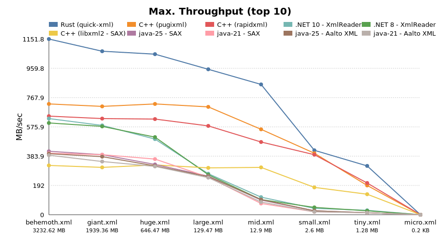
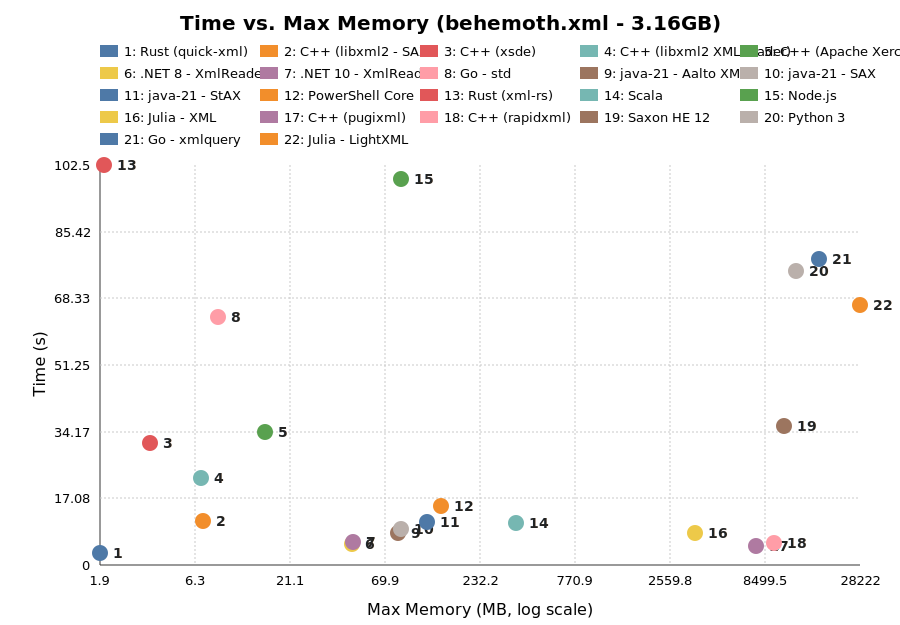

# Benchmark Results 03/13/2026 22:38:24

## System Information
```
Hostname: tpX13
Kernel: Linux 6.18.12-1-MANJARO x86_64 GNU/Linux
Distro: Manjaro Linux
CPU: 12th Gen Intel(R) Core(TM) i7-1270P
Disk: WD PC SN740 SDDQNQD-512G-1201
Memory: 31Gi
```

## Overall Results






### behemoth.xml (3232.62 MB)

| Rank | Variant                   | Time (s)   | Throughput (MB/s) | Max Mem (MB) |
|------|---------------------------|------------|-------------------|--------------|
|      | C (noxml)                 | 1.474      | 2,192.448         | 1.66         |
|      | Rust (noxml)              | 1.958      | 1,651.261         | 3,242.70     |
| 1    | Rust (quick-xml)          | 2.807      | 1,151.797         | 2.16         |
| 2    | C++ (pugixml)             | 4.454      | 725.827           | 7,597.18     |
| 3    | C++ (rapidxml)            | 5.008      | 645.533           | 9,492.37     |
| 4    | .NET 10 - XmlReader       | 5.117      | 631.784           | 46.34        |
| 5    | .NET 8 - XmlReader        | 5.381      | 600.780           | 46.32        |
| 6    | java-25 - SAX             | 7.776      | 415.692           | 93.66        |
| 7    | java-21 - SAX             | 7.989      | 404.635           | 86.91        |
| 8    | java-25 - Aalto XML       | 8.074      | 400.359           | 92.76        |
| 9    | java-21 - Aalto XML       | 8.282      | 390.299           | 85.44        |
| 10   | Scala                     | 8.629      | 374.636           | 364.29       |
| 11   | java-21 - StAX            | 8.951      | 361.131           | 121.27       |
| 12   | java-25 - StAX            | 9.152      | 353.216           | 118.66       |
| 13   | PowerShell Core           | 9.292      | 347.874           | 130.10       |
| 14   | C++ (libxml2 - SAX)       | 9.980      | 323.908           | 7.23         |
| 15   | Julia - XML               | 13.510     | 239.277           | 3,559.01     |
| 16   | C++ (libxml2 XMLReader)   | 17.008     | 190.069           | 7.23         |
| 17   | C++ (xsde)                | 24.838     | 130.149           | 3.99         |
| 18   | Saxon HE 12               | 28.564     | 113.170           | 10,956.16    |
| 19   | C++ (Apache Xerces)       | 30.527     | 105.894           | 16.59        |
| 20   | Julia - LightXML          | 30.922     | 104.540           | 28,314.88    |
| 21   | Perl                      | 40.001     | 80.814            | 13.42        |
| 22   | Lua                       | 46.641     | 69.308            | 3.10         |
| 23   | Go - std                  | 47.866     | 67.535            | 8.60         |
| 24   | Python 3                  | 51.874     | 62.317            | 12,612.29    |
| 25   | Go - xmlquery             | 62.842     | 51.441            | 16,830.92    |
| 26   | Rust (xml-rs)             | 84.418     | 38.293            | 2.18         |
| 27   | Node.js                   | 85.766     | 37.691            | 83.82        |


### giant.xml (1939.36 MB)

| Rank | Variant                   | Time (s)   | Throughput (MB/s) | Max Mem (MB) |
|------|---------------------------|------------|-------------------|--------------|
|      | C (noxml)                 | 1.032      | 1,878.351         | 1.39         |
|      | Rust (noxml)              | 1.352      | 1,434.222         | 1,949.50     |
| 1    | Rust (quick-xml)          | 1.808      | 1,072.743         | 2.25         |
| 2    | C++ (pugixml)             | 2.732      | 709.773           | 4,559.54     |
| 3    | C++ (rapidxml)            | 3.082      | 629.182           | 5,696.29     |
| 4    | .NET 10 - XmlReader       | 3.308      | 586.296           | 46.63        |
| 5    | .NET 8 - XmlReader        | 3.352      | 578.573           | 46.66        |
| 6    | java-21 - SAX             | 4.913      | 394.757           | 83.53        |
| 7    | java-25 - SAX             | 4.926      | 393.728           | 96.88        |
| 8    | java-25 - Aalto XML       | 5.101      | 380.217           | 94.62        |
| 9    | java-25 - StAX            | 5.476      | 354.135           | 121.26       |
| 10   | java-21 - Aalto XML       | 5.570      | 348.150           | 88.53        |
| 11   | Scala                     | 6.040      | 321.076           | 249.64       |
| 12   | java-21 - StAX            | 6.060      | 320.019           | 123.95       |
| 13   | C++ (libxml2 - SAX)       | 6.236      | 310.995           | 6.89         |
| 14   | PowerShell Core           | 6.595      | 294.065           | 135.34       |
| 15   | Julia - XML               | 9.760      | 198.714           | 2,268.11     |
| 16   | C++ (libxml2 XMLReader)   | 10.063     | 192.725           | 7.50         |
| 17   | C++ (xsde)                | 14.806     | 130.986           | 4.23         |
| 18   | Saxon HE 12               | 17.307     | 112.054           | 6,478.72     |
| 19   | C++ (Apache Xerces)       | 18.488     | 104.900           | 16.49        |
| 20   | Julia - LightXML          | 19.617     | 98.860            | 17,113.92    |
| 21   | Lua                       | 29.100     | 66.646            | 3.07         |
| 22   | Perl                      | 30.137     | 64.351            | 12.21        |
| 23   | Go - std                  | 30.250     | 64.112            | 8.67         |
| 24   | Python 3                  | 31.599     | 61.374            | 7,572.24     |
| 25   | Go - xmlquery             | 39.581     | 48.997            | 9,980.03     |
| 26   | Node.js                   | 54.279     | 35.729            | 84.14        |
| 27   | Rust (xml-rs)             | 54.317     | 35.704            | 2.19         |


### huge.xml (646.47 MB)

| Rank | Variant                   | Time (s)   | Throughput (MB/s) | Max Mem (MB) |
|------|---------------------------|------------|-------------------|--------------|
|      | C (noxml)                 | 0.335      | 1,929.663         | 1.70         |
|      | Rust (noxml)              | 0.451      | 1,433.053         | 652.56       |
| 1    | Rust (quick-xml)          | 0.615      | 1,051.290         | 2.09         |
| 2    | C++ (pugixml)             | 0.890      | 726.288           | 1,522.37     |
| 3    | C++ (rapidxml)            | 1.030      | 627.636           | 1,901.19     |
| 4    | .NET 8 - XmlReader        | 1.271      | 508.547           | 46.68        |
| 5    | .NET 10 - XmlReader       | 1.303      | 496.073           | 46.67        |
| 6    | java-21 - SAX             | 1.769      | 365.414           | 79.33        |
| 7    | java-25 - SAX             | 1.961      | 329.649           | 84.66        |
| 8    | C++ (libxml2 - SAX)       | 1.987      | 325.411           | 7.03         |
| 9    | java-25 - Aalto XML       | 2.022      | 319.638           | 84.37        |
| 10   | java-21 - Aalto XML       | 2.047      | 315.821           | 77.50        |
| 11   | java-25 - StAX            | 2.169      | 298.048           | 121.54       |
| 12   | java-21 - StAX            | 2.205      | 293.242           | 122.83       |
| 13   | Scala                     | 2.374      | 272.359           | 135.73       |
| 14   | PowerShell Core           | 2.885      | 224.096           | 135.29       |
| 15   | C++ (libxml2 XMLReader)   | 3.351      | 192.942           | 7.29         |
| 16   | Julia - XML               | 4.017      | 160.924           | 975.17       |
| 17   | C++ (xsde)                | 5.273      | 122.603           | 4.07         |
| 18   | Saxon HE 12               | 6.723      | 96.158            | 3,112.98     |
| 19   | Julia - LightXML          | 6.845      | 94.438            | 5,913.85     |
| 20   | C++ (Apache Xerces)       | 6.856      | 94.286            | 16.50        |
| 21   | Perl                      | 8.481      | 76.227            | 10.95        |
| 22   | Lua                       | 9.794      | 66.005            | 3.01         |
| 23   | Go - std                  | 10.193     | 63.420            | 8.69         |
| 24   | Python 3                  | 10.761     | 60.075            | 2,533.28     |
| 25   | Go - xmlquery             | 13.187     | 49.024            | 3,412.87     |
| 26   | Node.js                   | 17.594     | 36.744            | 70.24        |
| 27   | Rust (xml-rs)             | 17.626     | 36.676            | 2.15         |


### large.xml (129.47 MB)

| Rank | Variant                   | Time (s)   | Throughput (MB/s) | Max Mem (MB) |
|------|---------------------------|------------|-------------------|--------------|
|      | C (noxml)                 | 0.077      | 1,674.825         | 1.53         |
|      | Rust (noxml)              | 0.118      | 1,096.687         | 135.60       |
| 1    | Rust (quick-xml)          | 0.136      | 954.654           | 2.06         |
| 2    | C++ (pugixml)             | 0.183      | 705.542           | 307.85       |
| 3    | C++ (rapidxml)            | 0.222      | 582.771           | 383.66       |
| 4    | C++ (libxml2 - SAX)       | 0.423      | 305.975           | 7.12         |
| 5    | .NET 10 - XmlReader       | 0.482      | 268.825           | 44.12        |
| 6    | .NET 8 - XmlReader        | 0.491      | 263.878           | 44.16        |
| 7    | java-25 - SAX             | 0.512      | 252.640           | 84.29        |
| 8    | java-25 - Aalto XML       | 0.522      | 248.156           | 81.35        |
| 9    | java-21 - SAX             | 0.527      | 245.507           | 72.79        |
| 10   | java-21 - Aalto XML       | 0.535      | 241.803           | 73.44        |
| 11   | java-25 - StAX            | 0.550      | 235.513           | 96.71        |
| 12   | java-21 - StAX            | 0.565      | 229.106           | 98.91        |
| 13   | C++ (libxml2 XMLReader)   | 0.684      | 189.224           | 7.70         |
| 14   | Scala                     | 0.822      | 157.566           | 106.36       |
| 15   | C++ (xsde)                | 1.013      | 127.864           | 3.99         |
| 16   | PowerShell Core           | 1.224      | 105.766           | 135.36       |
| 17   | C++ (Apache Xerces)       | 1.367      | 94.681            | 16.50        |
| 18   | Julia - LightXML          | 1.667      | 77.684            | 1,435.21     |
| 19   | Julia - XML               | 1.671      | 77.459            | 458.11       |
| 20   | Perl                      | 1.734      | 74.653            | 10.43        |
| 21   | Go - std                  | 2.029      | 63.809            | 8.66         |
| 22   | Python 3                  | 2.164      | 59.837            | 518.01       |
| 23   | Saxon HE 12               | 2.336      | 55.425            | 843.85       |
| 24   | Lua                       | 2.417      | 53.564            | 3.05         |
| 25   | Go - xmlquery             | 2.660      | 48.663            | 723.70       |
| 26   | Rust (xml-rs)             | 3.607      | 35.891            | 2.32         |
| 27   | Node.js                   | 3.629      | 35.676            | 61.81        |


### mid.xml (12.9 MB)

| Rank | Variant                   | Time (s)   | Throughput (MB/s) | Max Mem (MB) |
|------|---------------------------|------------|-------------------|--------------|
|      | C (noxml)                 | 0.010      | 1,287.633         | 1.45         |
| 1    | Rust (quick-xml)          | 0.015      | 854.146           | 2.12         |
|      | Rust (noxml)              | 0.022      | 582.021           | 22.97        |
| 2    | C++ (pugixml)             | 0.023      | 561.126           | 34.02        |
| 3    | C++ (rapidxml)            | 0.027      | 477.687           | 41.46        |
| 4    | C++ (libxml2 - SAX)       | 0.041      | 310.886           | 7.00         |
| 5    | C++ (libxml2 XMLReader)   | 0.073      | 176.423           | 6.90         |
| 6    | C++ (xsde)                | 0.103      | 124.776           | 4.09         |
| 7    | .NET 10 - XmlReader       | 0.112      | 115.498           | 35.62        |
| 8    | .NET 8 - XmlReader        | 0.130      | 99.357            | 35.58        |
| 9    | java-25 - Aalto XML       | 0.132      | 97.746            | 69.98        |
| 10   | java-25 - SAX             | 0.132      | 97.441            | 70.24        |
| 11   | C++ (Apache Xerces)       | 0.135      | 95.567            | 16.51        |
| 12   | java-25 - StAX            | 0.146      | 88.435            | 87.03        |
| 13   | java-21 - Aalto XML       | 0.158      | 81.842            | 70.15        |
| 14   | java-21 - StAX            | 0.167      | 77.172            | 93.00        |
| 15   | java-21 - SAX             | 0.172      | 74.988            | 70.96        |
| 16   | Perl                      | 0.190      | 68.019            | 10.20        |
| 17   | Lua                       | 0.205      | 62.839            | 3.01         |
| 18   | Go - std                  | 0.214      | 60.129            | 8.64         |
| 19   | Python 3                  | 0.229      | 56.408            | 64.07        |
| 20   | Go - xmlquery             | 0.285      | 45.286            | 78.68        |
| 21   | Rust (xml-rs)             | 0.362      | 35.656            | 2.26         |
| 22   | PowerShell Core           | 0.375      | 34.385            | 133.83       |
| 23   | Julia - LightXML          | 0.402      | 32.044            | 399.62       |
| 24   | Scala                     | 0.404      | 31.943            | 99.40        |
| 25   | Node.js                   | 0.423      | 30.464            | 58.46        |
| 26   | Saxon HE 12               | 1.094      | 11.792            | 238.63       |
| 27   | Julia - XML               | 1.128      | 11.437            | 341.88       |


### small.xml (2.6 MB)

| Rank | Variant                   | Time (s)   | Throughput (MB/s) | Max Mem (MB) |
|------|---------------------------|------------|-------------------|--------------|
|      | C (noxml)                 | 0.005      | 477.041           | 1.52         |
|      | Rust (noxml)              | 0.006      | 429.360           | 7.28         |
| 1    | Rust (quick-xml)          | 0.006      | 421.314           | 2.08         |
| 2    | C++ (pugixml)             | 0.006      | 401.638           | 9.95         |
| 3    | C++ (rapidxml)            | 0.007      | 392.660           | 11.36        |
| 4    | C++ (libxml2 - SAX)       | 0.015      | 177.851           | 7.11         |
| 5    | C++ (libxml2 XMLReader)   | 0.021      | 121.677           | 7.05         |
| 6    | C++ (xsde)                | 0.026      | 99.282            | 3.99         |
| 7    | C++ (Apache Xerces)       | 0.037      | 71.167            | 16.37        |
| 8    | Go - std                  | 0.043      | 60.663            | 8.52         |
| 9    | .NET 8 - XmlReader        | 0.053      | 49.114            | 35.07        |
| 10   | Lua                       | 0.055      | 47.715            | 2.97         |
| 11   | Perl                      | 0.056      | 46.356            | 10.25        |
| 12   | .NET 10 - XmlReader       | 0.064      | 40.603            | 35.09        |
| 13   | Go - xmlquery             | 0.070      | 37.097            | 27.04        |
| 14   | Python 3                  | 0.072      | 36.065            | 23.84        |
| 15   | Rust (xml-rs)             | 0.079      | 32.930            | 2.19         |
| 16   | java-25 - Aalto XML       | 0.098      | 26.475            | 65.45        |
| 17   | java-25 - SAX             | 0.104      | 25.118            | 66.96        |
| 18   | java-25 - StAX            | 0.107      | 24.262            | 78.96        |
| 19   | java-21 - Aalto XML       | 0.128      | 20.337            | 69.42        |
| 20   | java-21 - StAX            | 0.129      | 20.092            | 82.57        |
| 21   | java-21 - SAX             | 0.130      | 19.948            | 67.07        |
| 22   | Node.js                   | 0.133      | 19.496            | 57.98        |
| 23   | PowerShell Core           | 0.278      | 9.344             | 131.05       |
| 24   | Julia - LightXML          | 0.286      | 9.091             | 302.45       |
| 25   | Scala                     | 0.362      | 7.186             | 92.17        |
| 26   | Saxon HE 12               | 0.845      | 3.079             | 172.71       |
| 27   | Julia - XML               | 1.018      | 2.556             | 331.34       |


### tiny.xml (1.28 MB)

| Rank | Variant                   | Time (s)   | Throughput (MB/s) | Max Mem (MB) |
|------|---------------------------|------------|-------------------|--------------|
| 1    | Rust (quick-xml)          | 0.004      | 320.825           | 2.12         |
|      | Rust (noxml)              | 0.004      | 291.623           | 4.64         |
|      | C (noxml)                 | 0.004      | 291.397           | 1.53         |
| 2    | C++ (rapidxml)            | 0.006      | 206.803           | 7.50         |
| 3    | C++ (pugixml)             | 0.007      | 193.270           | 6.86         |
| 4    | C++ (libxml2 - SAX)       | 0.010      | 133.111           | 6.91         |
| 5    | C++ (libxml2 XMLReader)   | 0.012      | 108.210           | 7.39         |
| 6    | C++ (xsde)                | 0.015      | 82.910            | 4.09         |
| 7    | Go - std                  | 0.022      | 56.950            | 8.21         |
| 8    | C++ (Apache Xerces)       | 0.023      | 56.718            | 16.57        |
| 9    | Lua                       | 0.032      | 39.508            | 3.00         |
| 10   | Perl                      | 0.035      | 36.419            | 10.24        |
| 11   | Go - xmlquery             | 0.039      | 32.874            | 16.77        |
| 12   | .NET 10 - XmlReader       | 0.046      | 27.886            | 35.03        |
| 13   | .NET 8 - XmlReader        | 0.049      | 26.406            | 35.02        |
| 14   | Rust (xml-rs)             | 0.049      | 26.387            | 2.25         |
| 15   | Python 3                  | 0.051      | 25.258            | 18.68        |
| 16   | Node.js                   | 0.091      | 14.081            | 58.61        |
| 17   | java-25 - Aalto XML       | 0.091      | 14.017            | 65.61        |
| 18   | java-25 - SAX             | 0.094      | 13.678            | 63.53        |
| 19   | java-25 - StAX            | 0.105      | 12.239            | 75.60        |
| 20   | java-21 - Aalto XML       | 0.113      | 11.349            | 64.91        |
| 21   | java-21 - SAX             | 0.114      | 11.243            | 64.95        |
| 22   | java-21 - StAX            | 0.118      | 10.845            | 78.90        |
| 23   | PowerShell Core           | 0.257      | 4.980             | 126.91       |
| 24   | Julia - LightXML          | 0.274      | 4.681             | 289.11       |
| 25   | Scala                     | 0.353      | 3.630             | 90.65        |
| 26   | Saxon HE 12               | 0.849      | 1.510             | 156.21       |
| 27   | Julia - XML               | 1.014      | 1.264             | 328.08       |


### micro.xml (0.2 KB)

| Rank | Variant                   | Time (s)   | Throughput (MB/s) | Max Mem (MB) |
|------|---------------------------|------------|-------------------|--------------|
|      | C (noxml)                 | 0.001      | 0.156             | 1.60         |
| 1    | Rust (quick-xml)          | 0.002      | 0.114             | 2.12         |
|      | Rust (noxml)              | 0.002      | 0.107             | 2.06         |
| 2    | Rust (xml-rs)             | 0.002      | 0.095             | 2.13         |
| 3    | Go - std                  | 0.002      | 0.094             | 3.75         |
| 4    | C++ (xsde)                | 0.002      | 0.088             | 4.12         |
| 5    | C++ (rapidxml)            | 0.003      | 0.085             | 3.72         |
| 6    | C++ (pugixml)             | 0.003      | 0.085             | 3.78         |
| 7    | C++ (libxml2 - SAX)       | 0.003      | 0.080             | 6.93         |
| 8    | C++ (libxml2 XMLReader)   | 0.003      | 0.064             | 7.39         |
| 9    | Go - xmlquery             | 0.003      | 0.063             | 7.11         |
| 10   | Lua                       | 0.005      | 0.043             | 2.97         |
| 11   | C++ (Apache Xerces)       | 0.011      | 0.020             | 16.52        |
| 12   | Perl                      | 0.019      | 0.012             | 10.15        |
| 13   | Python 3                  | 0.028      | 0.008             | 13.60        |
| 14   | Node.js                   | 0.034      | 0.006             | 45.74        |
| 15   | .NET 10 - XmlReader       | 0.037      | 0.006             | 34.09        |
| 16   | .NET 8 - XmlReader        | 0.039      | 0.006             | 34.03        |
| 17   | java-25 - Aalto XML       | 0.043      | 0.005             | 47.28        |
| 18   | java-25 - StAX            | 0.049      | 0.004             | 59.68        |
| 19   | java-21 - Aalto XML       | 0.050      | 0.004             | 46.53        |
| 20   | java-25 - SAX             | 0.052      | 0.004             | 47.19        |
| 21   | java-21 - SAX             | 0.060      | 0.004             | 47.21        |
| 22   | java-21 - StAX            | 0.068      | 0.003             | 61.32        |
| 23   | PowerShell Core           | 0.242      | 0.001             | 123.74       |
| 24   | Julia - LightXML          | 0.257      | 0.001             | 279.62       |
| 25   | Scala                     | 0.267      | 0.001             | 73.57        |
| 26   | Saxon HE 12               | 0.716      | 0.000             | 122.11       |
| 27   | Julia - XML               | 1.021      | 0.000             | 322.80       |


## App - Results


### .NET 10 - XmlReader

xml-i in .NET 10

```
10.0.103
```

| File                      | Time (s)   | Throughput (MB/s) | Max Mem (MB) |
|---------------------------|------------|-------------------|--------------|
| behemoth.xml              | 5.117      | 631.784           | 46.34        |
| giant.xml                 | 3.308      | 586.296           | 46.63        |
| huge.xml                  | 1.303      | 496.073           | 46.67        |
| large.xml                 | 0.482      | 268.825           | 44.12        |
| mid.xml                   | 0.112      | 115.498           | 35.62        |
| small.xml                 | 0.064      | 40.603            | 35.09        |
| tiny.xml                  | 0.046      | 27.886            | 35.03        |
| micro.xml                 | 0.037      | 0.006             | 34.09        |

### .NET 8 - XmlReader

xml-i in .NET 8

```
10.0.103
```

| File                      | Time (s)   | Throughput (MB/s) | Max Mem (MB) |
|---------------------------|------------|-------------------|--------------|
| behemoth.xml              | 5.381      | 600.780           | 46.32        |
| giant.xml                 | 3.352      | 578.573           | 46.66        |
| huge.xml                  | 1.271      | 508.547           | 46.68        |
| large.xml                 | 0.491      | 263.878           | 44.16        |
| mid.xml                   | 0.130      | 99.357            | 35.58        |
| small.xml                 | 0.053      | 49.114            | 35.07        |
| tiny.xml                  | 0.049      | 26.406            | 35.02        |
| micro.xml                 | 0.039      | 0.006             | 34.03        |

### C (noxml)

xml-i in pure C, without xml library


| File                      | Time (s)   | Throughput (MB/s) | Max Mem (MB) |
|---------------------------|------------|-------------------|--------------|
| behemoth.xml              | 1.474      | 2,192.448         | 1.66         |
| giant.xml                 | 1.032      | 1,878.351         | 1.39         |
| huge.xml                  | 0.335      | 1,929.663         | 1.70         |
| large.xml                 | 0.077      | 1,674.825         | 1.53         |
| mid.xml                   | 0.010      | 1,287.633         | 1.45         |
| small.xml                 | 0.005      | 477.041           | 1.52         |
| tiny.xml                  | 0.004      | 291.397           | 1.53         |
| micro.xml                 | 0.001      | 0.156             | 1.60         |

### C++ (Apache Xerces)

xml-i in C++ powered by Apache Xerces


| File                      | Time (s)   | Throughput (MB/s) | Max Mem (MB) |
|---------------------------|------------|-------------------|--------------|
| behemoth.xml              | 30.527     | 105.894           | 16.59        |
| giant.xml                 | 18.488     | 104.900           | 16.49        |
| huge.xml                  | 6.856      | 94.286            | 16.50        |
| large.xml                 | 1.367      | 94.681            | 16.50        |
| mid.xml                   | 0.135      | 95.567            | 16.51        |
| small.xml                 | 0.037      | 71.167            | 16.37        |
| tiny.xml                  | 0.023      | 56.718            | 16.57        |
| micro.xml                 | 0.011      | 0.020             | 16.52        |

### C++ (libxml2 - SAX)

xml-i in C++ powered by libxml2


| File                      | Time (s)   | Throughput (MB/s) | Max Mem (MB) |
|---------------------------|------------|-------------------|--------------|
| behemoth.xml              | 9.980      | 323.908           | 7.23         |
| giant.xml                 | 6.236      | 310.995           | 6.89         |
| huge.xml                  | 1.987      | 325.411           | 7.03         |
| large.xml                 | 0.423      | 305.975           | 7.12         |
| mid.xml                   | 0.041      | 310.886           | 7.00         |
| small.xml                 | 0.015      | 177.851           | 7.11         |
| tiny.xml                  | 0.010      | 133.111           | 6.91         |
| micro.xml                 | 0.003      | 0.080             | 6.93         |

### C++ (libxml2 XMLReader)

xml-i in C++ powered by libxml2 XMLReader


| File                      | Time (s)   | Throughput (MB/s) | Max Mem (MB) |
|---------------------------|------------|-------------------|--------------|
| behemoth.xml              | 17.008     | 190.069           | 7.23         |
| giant.xml                 | 10.063     | 192.725           | 7.50         |
| huge.xml                  | 3.351      | 192.942           | 7.29         |
| large.xml                 | 0.684      | 189.224           | 7.70         |
| mid.xml                   | 0.073      | 176.423           | 6.90         |
| small.xml                 | 0.021      | 121.677           | 7.05         |
| tiny.xml                  | 0.012      | 108.210           | 7.39         |
| micro.xml                 | 0.003      | 0.064             | 7.39         |

### C++ (pugixml)

xml-i in C++ powered by pugixml


| File                      | Time (s)   | Throughput (MB/s) | Max Mem (MB) |
|---------------------------|------------|-------------------|--------------|
| behemoth.xml              | 4.454      | 725.827           | 7,597.18     |
| giant.xml                 | 2.732      | 709.773           | 4,559.54     |
| huge.xml                  | 0.890      | 726.288           | 1,522.37     |
| large.xml                 | 0.183      | 705.542           | 307.85       |
| mid.xml                   | 0.023      | 561.126           | 34.02        |
| tiny.xml                  | 0.007      | 193.270           | 6.86         |
| small.xml                 | 0.006      | 401.638           | 9.95         |
| micro.xml                 | 0.003      | 0.085             | 3.78         |

### C++ (rapidxml)

xml-i in C++ powered by rapidxml


| File                      | Time (s)   | Throughput (MB/s) | Max Mem (MB) |
|---------------------------|------------|-------------------|--------------|
| behemoth.xml              | 5.008      | 645.533           | 9,492.37     |
| giant.xml                 | 3.082      | 629.182           | 5,696.29     |
| huge.xml                  | 1.030      | 627.636           | 1,901.19     |
| large.xml                 | 0.222      | 582.771           | 383.66       |
| mid.xml                   | 0.027      | 477.687           | 41.46        |
| small.xml                 | 0.007      | 392.660           | 11.36        |
| tiny.xml                  | 0.006      | 206.803           | 7.50         |
| micro.xml                 | 0.003      | 0.085             | 3.72         |

### C++ (xsde)

xml-i in C++ powered by CodeSynthesis xsde


| File                      | Time (s)   | Throughput (MB/s) | Max Mem (MB) |
|---------------------------|------------|-------------------|--------------|
| behemoth.xml              | 24.838     | 130.149           | 3.99         |
| giant.xml                 | 14.806     | 130.986           | 4.23         |
| huge.xml                  | 5.273      | 122.603           | 4.07         |
| large.xml                 | 1.013      | 127.864           | 3.99         |
| mid.xml                   | 0.103      | 124.776           | 4.09         |
| small.xml                 | 0.026      | 99.282            | 3.99         |
| tiny.xml                  | 0.015      | 82.910            | 4.09         |
| micro.xml                 | 0.002      | 0.088             | 4.12         |

### Go - std

xml-i in Go (using standard library encoding/xml)

```
go version go1.25.7 X:nodwarf5 linux/amd64
```

| File                      | Time (s)   | Throughput (MB/s) | Max Mem (MB) |
|---------------------------|------------|-------------------|--------------|
| behemoth.xml              | 47.866     | 67.535            | 8.60         |
| giant.xml                 | 30.250     | 64.112            | 8.67         |
| huge.xml                  | 10.193     | 63.420            | 8.69         |
| large.xml                 | 2.029      | 63.809            | 8.66         |
| mid.xml                   | 0.214      | 60.129            | 8.64         |
| small.xml                 | 0.043      | 60.663            | 8.52         |
| tiny.xml                  | 0.022      | 56.950            | 8.21         |
| micro.xml                 | 0.002      | 0.094             | 3.75         |

### Go - xmlquery

xml-i in Go (using antchfx/xmlquery)

```
go version go1.25.7 X:nodwarf5 linux/amd64
```

| File                      | Time (s)   | Throughput (MB/s) | Max Mem (MB) |
|---------------------------|------------|-------------------|--------------|
| behemoth.xml              | 62.842     | 51.441            | 16,830.92    |
| giant.xml                 | 39.581     | 48.997            | 9,980.03     |
| huge.xml                  | 13.187     | 49.024            | 3,412.87     |
| large.xml                 | 2.660      | 48.663            | 723.70       |
| mid.xml                   | 0.285      | 45.286            | 78.68        |
| small.xml                 | 0.070      | 37.097            | 27.04        |
| tiny.xml                  | 0.039      | 32.874            | 16.77        |
| micro.xml                 | 0.003      | 0.063             | 7.11         |

### java-21 - Aalto XML

xml-i in pure Java (java-21-openjdk), using Aalto XML

```
openjdk 21.0.10 2026-01-20
OpenJDK Runtime Environment (build 21.0.10+7)
OpenJDK 64-Bit Server VM (build 21.0.10+7, mixed mode, sharing)
```

| File                      | Time (s)   | Throughput (MB/s) | Max Mem (MB) |
|---------------------------|------------|-------------------|--------------|
| behemoth.xml              | 8.282      | 390.299           | 85.44        |
| giant.xml                 | 5.570      | 348.150           | 88.53        |
| huge.xml                  | 2.047      | 315.821           | 77.50        |
| large.xml                 | 0.535      | 241.803           | 73.44        |
| mid.xml                   | 0.158      | 81.842            | 70.15        |
| small.xml                 | 0.128      | 20.337            | 69.42        |
| tiny.xml                  | 0.113      | 11.349            | 64.91        |
| micro.xml                 | 0.050      | 0.004             | 46.53        |

### java-21 - SAX

xml-i in pure Java (java-21-openjdk), using org.xml.sax

```
openjdk 21.0.10 2026-01-20
OpenJDK Runtime Environment (build 21.0.10+7)
OpenJDK 64-Bit Server VM (build 21.0.10+7, mixed mode, sharing)
```

| File                      | Time (s)   | Throughput (MB/s) | Max Mem (MB) |
|---------------------------|------------|-------------------|--------------|
| behemoth.xml              | 7.989      | 404.635           | 86.91        |
| giant.xml                 | 4.913      | 394.757           | 83.53        |
| huge.xml                  | 1.769      | 365.414           | 79.33        |
| large.xml                 | 0.527      | 245.507           | 72.79        |
| mid.xml                   | 0.172      | 74.988            | 70.96        |
| small.xml                 | 0.130      | 19.948            | 67.07        |
| tiny.xml                  | 0.114      | 11.243            | 64.95        |
| micro.xml                 | 0.060      | 0.004             | 47.21        |

### java-21 - StAX

xml-i in pure Java (java-21-openjdk), using javax.xml.stream

```
openjdk 21.0.10 2026-01-20
OpenJDK Runtime Environment (build 21.0.10+7)
OpenJDK 64-Bit Server VM (build 21.0.10+7, mixed mode, sharing)
```

| File                      | Time (s)   | Throughput (MB/s) | Max Mem (MB) |
|---------------------------|------------|-------------------|--------------|
| behemoth.xml              | 8.951      | 361.131           | 121.27       |
| giant.xml                 | 6.060      | 320.019           | 123.95       |
| huge.xml                  | 2.205      | 293.242           | 122.83       |
| large.xml                 | 0.565      | 229.106           | 98.91        |
| mid.xml                   | 0.167      | 77.172            | 93.00        |
| small.xml                 | 0.129      | 20.092            | 82.57        |
| tiny.xml                  | 0.118      | 10.845            | 78.90        |
| micro.xml                 | 0.068      | 0.003             | 61.32        |

### java-25 - Aalto XML

xml-i in pure Java (java-25-openjdk), using Aalto XML

```
openjdk 25.0.2 2026-01-20
OpenJDK Runtime Environment (build 25.0.2)
OpenJDK 64-Bit Server VM (build 25.0.2, mixed mode, sharing)
```

| File                      | Time (s)   | Throughput (MB/s) | Max Mem (MB) |
|---------------------------|------------|-------------------|--------------|
| behemoth.xml              | 8.074      | 400.359           | 92.76        |
| giant.xml                 | 5.101      | 380.217           | 94.62        |
| huge.xml                  | 2.022      | 319.638           | 84.37        |
| large.xml                 | 0.522      | 248.156           | 81.35        |
| mid.xml                   | 0.132      | 97.746            | 69.98        |
| small.xml                 | 0.098      | 26.475            | 65.45        |
| tiny.xml                  | 0.091      | 14.017            | 65.61        |
| micro.xml                 | 0.043      | 0.005             | 47.28        |

### java-25 - SAX

xml-i in pure Java (java-25-openjdk), using org.xml.sax

```
openjdk 25.0.2 2026-01-20
OpenJDK Runtime Environment (build 25.0.2)
OpenJDK 64-Bit Server VM (build 25.0.2, mixed mode, sharing)
```

| File                      | Time (s)   | Throughput (MB/s) | Max Mem (MB) |
|---------------------------|------------|-------------------|--------------|
| behemoth.xml              | 7.776      | 415.692           | 93.66        |
| giant.xml                 | 4.926      | 393.728           | 96.88        |
| huge.xml                  | 1.961      | 329.649           | 84.66        |
| large.xml                 | 0.512      | 252.640           | 84.29        |
| mid.xml                   | 0.132      | 97.441            | 70.24        |
| small.xml                 | 0.104      | 25.118            | 66.96        |
| tiny.xml                  | 0.094      | 13.678            | 63.53        |
| micro.xml                 | 0.052      | 0.004             | 47.19        |

### java-25 - StAX

xml-i in pure Java (java-25-openjdk), using javax.xml.stream

```
openjdk 25.0.2 2026-01-20
OpenJDK Runtime Environment (build 25.0.2)
OpenJDK 64-Bit Server VM (build 25.0.2, mixed mode, sharing)
```

| File                      | Time (s)   | Throughput (MB/s) | Max Mem (MB) |
|---------------------------|------------|-------------------|--------------|
| behemoth.xml              | 9.152      | 353.216           | 118.66       |
| giant.xml                 | 5.476      | 354.135           | 121.26       |
| huge.xml                  | 2.169      | 298.048           | 121.54       |
| large.xml                 | 0.550      | 235.513           | 96.71        |
| mid.xml                   | 0.146      | 88.435            | 87.03        |
| small.xml                 | 0.107      | 24.262            | 78.96        |
| tiny.xml                  | 0.105      | 12.239            | 75.60        |
| micro.xml                 | 0.049      | 0.004             | 59.68        |

### Julia - LightXML

xml-i in Julia with LightXML

```
julia version 1.12.5
```

| File                      | Time (s)   | Throughput (MB/s) | Max Mem (MB) |
|---------------------------|------------|-------------------|--------------|
| behemoth.xml              | 30.922     | 104.540           | 28,314.88    |
| giant.xml                 | 19.617     | 98.860            | 17,113.92    |
| huge.xml                  | 6.845      | 94.438            | 5,913.85     |
| large.xml                 | 1.667      | 77.684            | 1,435.21     |
| mid.xml                   | 0.402      | 32.044            | 399.62       |
| small.xml                 | 0.286      | 9.091             | 302.45       |
| tiny.xml                  | 0.274      | 4.681             | 289.11       |
| micro.xml                 | 0.257      | 0.001             | 279.62       |

### Julia - XML

xml-i in Julia with XML

```
julia version 1.12.5
```

| File                      | Time (s)   | Throughput (MB/s) | Max Mem (MB) |
|---------------------------|------------|-------------------|--------------|
| behemoth.xml              | 13.510     | 239.277           | 3,559.01     |
| giant.xml                 | 9.760      | 198.714           | 2,268.11     |
| huge.xml                  | 4.017      | 160.924           | 975.17       |
| large.xml                 | 1.671      | 77.459            | 458.11       |
| mid.xml                   | 1.128      | 11.437            | 341.88       |
| micro.xml                 | 1.021      | 0.000             | 322.80       |
| small.xml                 | 1.018      | 2.556             | 331.34       |
| tiny.xml                  | 1.014      | 1.264             | 328.08       |

### Lua

xml-i in Lua (LuaExpat)

```
Lua 5.4.8  Copyright (C) 1994-2025 Lua.org, PUC-Rio
```

| File                      | Time (s)   | Throughput (MB/s) | Max Mem (MB) |
|---------------------------|------------|-------------------|--------------|
| behemoth.xml              | 46.641     | 69.308            | 3.10         |
| giant.xml                 | 29.100     | 66.646            | 3.07         |
| huge.xml                  | 9.794      | 66.005            | 3.01         |
| large.xml                 | 2.417      | 53.564            | 3.05         |
| mid.xml                   | 0.205      | 62.839            | 3.01         |
| small.xml                 | 0.055      | 47.715            | 2.97         |
| tiny.xml                  | 0.032      | 39.508            | 3.00         |
| micro.xml                 | 0.005      | 0.043             | 2.97         |

### Node.js

xml-i in Node.js

```
v22.22.0
```

| File                      | Time (s)   | Throughput (MB/s) | Max Mem (MB) |
|---------------------------|------------|-------------------|--------------|
| behemoth.xml              | 85.766     | 37.691            | 83.82        |
| giant.xml                 | 54.279     | 35.729            | 84.14        |
| huge.xml                  | 17.594     | 36.744            | 70.24        |
| large.xml                 | 3.629      | 35.676            | 61.81        |
| mid.xml                   | 0.423      | 30.464            | 58.46        |
| small.xml                 | 0.133      | 19.496            | 57.98        |
| tiny.xml                  | 0.091      | 14.081            | 58.61        |
| micro.xml                 | 0.034      | 0.006             | 45.74        |

### Perl

xml-i in Perl

```

This is perl 5, version 42, subversion 0 (v5.42.0) built for x86_64-linux-thread-multi

Copyright 1987-2025, Larry Wall

Perl may be copied only under the terms of either the Artistic License or the
GNU General Public License, which may be found in the Perl 5 source kit.

Complete documentation for Perl, including FAQ lists, should be found on
this system using "man perl" or "perldoc perl".  If you have access to the
Internet, point your browser at https://www.perl.org/, the Perl Home Page.

```

| File                      | Time (s)   | Throughput (MB/s) | Max Mem (MB) |
|---------------------------|------------|-------------------|--------------|
| behemoth.xml              | 40.001     | 80.814            | 13.42        |
| giant.xml                 | 30.137     | 64.351            | 12.21        |
| huge.xml                  | 8.481      | 76.227            | 10.95        |
| large.xml                 | 1.734      | 74.653            | 10.43        |
| mid.xml                   | 0.190      | 68.019            | 10.20        |
| small.xml                 | 0.056      | 46.356            | 10.25        |
| tiny.xml                  | 0.035      | 36.419            | 10.24        |
| micro.xml                 | 0.019      | 0.012             | 10.15        |

### PowerShell Core

xml-i in pwsh

```

Name                           Value
----                           -----
PSVersion                      {[Major, 7], [Minor, 4], [Patch, 13], [PreReleaseLabel, ]…}
PSEdition                      Core
BuildVersion                   
CLRVersion                     
OS                             Manjaro Linux
```

| File                      | Time (s)   | Throughput (MB/s) | Max Mem (MB) |
|---------------------------|------------|-------------------|--------------|
| behemoth.xml              | 9.292      | 347.874           | 130.10       |
| giant.xml                 | 6.595      | 294.065           | 135.34       |
| huge.xml                  | 2.885      | 224.096           | 135.29       |
| large.xml                 | 1.224      | 105.766           | 135.36       |
| mid.xml                   | 0.375      | 34.385            | 133.83       |
| small.xml                 | 0.278      | 9.344             | 131.05       |
| tiny.xml                  | 0.257      | 4.980             | 126.91       |
| micro.xml                 | 0.242      | 0.001             | 123.74       |

### Python 3

xml-i in Python 3

```
Python 3.14.3
```

| File                      | Time (s)   | Throughput (MB/s) | Max Mem (MB) |
|---------------------------|------------|-------------------|--------------|
| behemoth.xml              | 51.874     | 62.317            | 12,612.29    |
| giant.xml                 | 31.599     | 61.374            | 7,572.24     |
| huge.xml                  | 10.761     | 60.075            | 2,533.28     |
| large.xml                 | 2.164      | 59.837            | 518.01       |
| mid.xml                   | 0.229      | 56.408            | 64.07        |
| small.xml                 | 0.072      | 36.065            | 23.84        |
| tiny.xml                  | 0.051      | 25.258            | 18.68        |
| micro.xml                 | 0.028      | 0.008             | 13.60        |

### Rust (noxml)

xml-i in Rust withouth xml library - plaintext parsing

```
cargo 1.93.0 (083ac5135 2025-12-15)
```

| File                      | Time (s)   | Throughput (MB/s) | Max Mem (MB) |
|---------------------------|------------|-------------------|--------------|
| behemoth.xml              | 1.958      | 1,651.261         | 3,242.70     |
| giant.xml                 | 1.352      | 1,434.222         | 1,949.50     |
| huge.xml                  | 0.451      | 1,433.053         | 652.56       |
| large.xml                 | 0.118      | 1,096.687         | 135.60       |
| mid.xml                   | 0.022      | 582.021           | 22.97        |
| small.xml                 | 0.006      | 429.360           | 7.28         |
| tiny.xml                  | 0.004      | 291.623           | 4.64         |
| micro.xml                 | 0.002      | 0.107             | 2.06         |

### Rust (quick-xml)

xml-i in Rust with quick-xml

```
cargo 1.93.0 (083ac5135 2025-12-15)
```

| File                      | Time (s)   | Throughput (MB/s) | Max Mem (MB) |
|---------------------------|------------|-------------------|--------------|
| behemoth.xml              | 2.807      | 1,151.797         | 2.16         |
| giant.xml                 | 1.808      | 1,072.743         | 2.25         |
| huge.xml                  | 0.615      | 1,051.290         | 2.09         |
| large.xml                 | 0.136      | 954.654           | 2.06         |
| mid.xml                   | 0.015      | 854.146           | 2.12         |
| small.xml                 | 0.006      | 421.314           | 2.08         |
| tiny.xml                  | 0.004      | 320.825           | 2.12         |
| micro.xml                 | 0.002      | 0.114             | 2.12         |

### Rust (xml-rs)

xml-i in Rust with xml-rs

```
cargo 1.93.0 (083ac5135 2025-12-15)
```

| File                      | Time (s)   | Throughput (MB/s) | Max Mem (MB) |
|---------------------------|------------|-------------------|--------------|
| behemoth.xml              | 84.418     | 38.293            | 2.18         |
| giant.xml                 | 54.317     | 35.704            | 2.19         |
| huge.xml                  | 17.626     | 36.676            | 2.15         |
| large.xml                 | 3.607      | 35.891            | 2.32         |
| mid.xml                   | 0.362      | 35.656            | 2.26         |
| small.xml                 | 0.079      | 32.930            | 2.19         |
| tiny.xml                  | 0.049      | 26.387            | 2.25         |
| micro.xml                 | 0.002      | 0.095             | 2.13         |

### Saxon HE 12

xml-i in xslt powered by Saxon HE 12

```
SaxonHE12-7J.zip
```

| File                      | Time (s)   | Throughput (MB/s) | Max Mem (MB) |
|---------------------------|------------|-------------------|--------------|
| behemoth.xml              | 28.564     | 113.170           | 10,956.16    |
| giant.xml                 | 17.307     | 112.054           | 6,478.72     |
| huge.xml                  | 6.723      | 96.158            | 3,112.98     |
| large.xml                 | 2.336      | 55.425            | 843.85       |
| mid.xml                   | 1.094      | 11.792            | 238.63       |
| tiny.xml                  | 0.849      | 1.510             | 156.21       |
| small.xml                 | 0.845      | 3.079             | 172.71       |
| micro.xml                 | 0.716      | 0.000             | 122.11       |

### Scala

xml-i in Scala

```
Scala code runner version: 1.8.0
Scala version (default): 3.7.1
```

| File                      | Time (s)   | Throughput (MB/s) | Max Mem (MB) |
|---------------------------|------------|-------------------|--------------|
| behemoth.xml              | 8.629      | 374.636           | 364.29       |
| giant.xml                 | 6.040      | 321.076           | 249.64       |
| huge.xml                  | 2.374      | 272.359           | 135.73       |
| large.xml                 | 0.822      | 157.566           | 106.36       |
| mid.xml                   | 0.404      | 31.943            | 99.40        |
| small.xml                 | 0.362      | 7.186             | 92.17        |
| tiny.xml                  | 0.353      | 3.630             | 90.65        |
| micro.xml                 | 0.267      | 0.001             | 73.57        |

