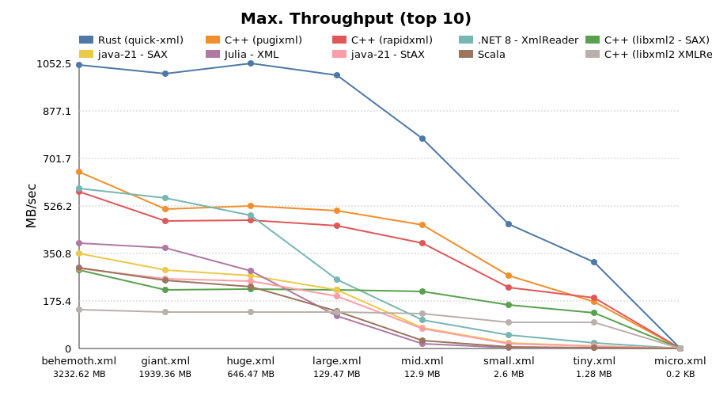
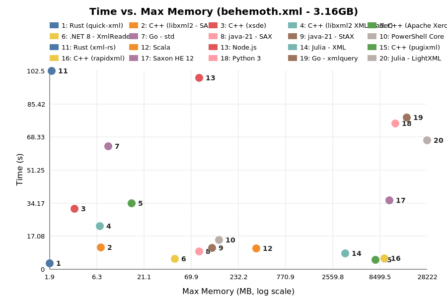

# Benchmark Results 06/12/2025 23:28:08

## System Information
```
Hostname: tpX13
Kernel: Linux 6.14.6-2-MANJARO x86_64 GNU/Linux
Distro: Manjaro Linux
CPU: 12th Gen Intel(R) Core(TM) i7-1270P
Disk: WD PC SN740 SDDQNQD-512G-1201
Memory: 31Gi
```

## Overall Results






### behemoth.xml (3232.62 MB)

| Rank | Variant                   | Time (s)   | Throughput (MB/s) | Max Mem (MB) |
|------|---------------------------|------------|-------------------|--------------|
| 1    | Rust (quick-xml)          | 3.174      | 1,018.309         | 2.06         |
| 2    | C++ (pugixml)             | 4.963      | 651.329           | 7,596.58     |
| 3    | .NET 8 - XmlReader        | 5.503      | 587.432           | 46.04        |
| 4    | C++ (rapidxml)            | 5.625      | 574.729           | 9,491.93     |
| 5    | java-21 - SAX             | 9.192      | 351.692           | 84.24        |
| 6    | java-21 - StAX            | 11.209     | 288.392           | 119.42       |
| 7    | C++ (libxml2 - SAX)       | 12.841     | 251.750           | 7.07         |
| 8    | Scala                     | 13.432     | 240.671           | 5.30         |
| 9    | PowerShell Core           | 15.247     | 212.012           | 140.04       |
| 10   | C++ (libxml2 XMLReader)   | 22.085     | 146.371           | 7.36         |
| 11   | C++ (xsde)                | 31.279     | 103.348           | 3.74         |
| 12   | Saxon HE 12               | 31.391     | 102.978           | 10,969.90    |
| 13   | C++ (Apache Xerces)       | 33.715     | 95.882            | 15.54        |
| 14   | Julia (LightXML)          | 36.321     | 89.001            | 28,275.60    |
| 15   | Go - std                  | 63.505     | 50.904            | 8.47         |
| 16   | Python 3                  | 75.924     | 42.577            | 12,610.81    |
| 17   | Go - xmlquery             | 77.936     | 41.478            | 17,395.11    |
| 18   | Node.js                   | 100.736    | 32.090            | 87.75        |
| 19   | Rust (xml-rs)             | 102.524    | 31.530            | 2.06         |


### giant.xml (1939.36 MB)

| Rank | Variant                   | Time (s)   | Throughput (MB/s) | Max Mem (MB) |
|------|---------------------------|------------|-------------------|--------------|
| 1    | Rust (quick-xml)          | 1.954      | 992.373           | 1.99         |
| 2    | .NET 8 - XmlReader        | 3.278      | 591.616           | 46.20        |
| 3    | C++ (pugixml)             | 3.651      | 531.147           | 4,558.94     |
| 4    | C++ (rapidxml)            | 4.084      | 474.909           | 5,695.94     |
| 5    | java-21 - SAX             | 6.830      | 283.930           | 86.23        |
| 6    | java-21 - StAX            | 7.508      | 258.290           | 120.90       |
| 7    | Scala                     | 8.335      | 232.690           | 5.18         |
| 8    | C++ (libxml2 - SAX)       | 8.786      | 220.740           | 7.33         |
| 9    | PowerShell Core           | 10.488     | 184.906           | 139.33       |
| 10   | C++ (libxml2 XMLReader)   | 14.374     | 134.917           | 7.21         |
| 11   | C++ (xsde)                | 19.869     | 97.608            | 3.88         |
| 12   | Saxon HE 12               | 22.088     | 87.802            | 6,723.52     |
| 13   | C++ (Apache Xerces)       | 22.492     | 86.226            | 15.25        |
| 14   | Julia (LightXML)          | 23.041     | 84.169            | 17,073.11    |
| 15   | Go - std                  | 39.127     | 49.566            | 8.61         |
| 16   | Python 3                  | 47.401     | 40.914            | 7,571.22     |
| 17   | Go - xmlquery             | 48.256     | 40.189            | 9,991.03     |
| 18   | Node.js                   | 61.250     | 31.663            | 82.72        |
| 19   | Rust (xml-rs)             | 62.161     | 31.199            | 2.04         |


### huge.xml (646.47 MB)

| Rank | Variant                   | Time (s)   | Throughput (MB/s) | Max Mem (MB) |
|------|---------------------------|------------|-------------------|--------------|
| 1    | Rust (quick-xml)          | 0.653      | 990.187           | 1.86         |
| 2    | C++ (pugixml)             | 1.226      | 527.299           | 1,522.03     |
| 3    | C++ (rapidxml)            | 1.338      | 483.053           | 1,900.82     |
| 4    | .NET 8 - XmlReader        | 1.352      | 478.256           | 46.22        |
| 5    | java-21 - SAX             | 2.355      | 274.496           | 76.06        |
| 6    | java-21 - StAX            | 2.625      | 246.279           | 121.14       |
| 7    | C++ (libxml2 - SAX)       | 2.934      | 220.330           | 7.16         |
| 8    | Scala                     | 3.214      | 201.153           | 5.21         |
| 9    | PowerShell Core           | 4.027      | 160.552           | 139.59       |
| 10   | C++ (libxml2 XMLReader)   | 4.771      | 135.507           | 7.13         |
| 11   | C++ (xsde)                | 6.625      | 97.578            | 3.37         |
| 12   | Julia (LightXML)          | 7.875      | 82.090            | 5,873.05     |
| 13   | Saxon HE 12               | 7.898      | 81.854            | 3,078.00     |
| 14   | C++ (Apache Xerces)       | 8.543      | 75.673            | 15.39        |
| 15   | Go - std                  | 13.104     | 49.335            | 8.34         |
| 16   | Python 3                  | 15.462     | 41.809            | 2,532.19     |
| 17   | Go - xmlquery             | 15.967     | 40.488            | 3,493.68     |
| 18   | Node.js                   | 20.366     | 31.742            | 69.14        |
| 19   | Rust (xml-rs)             | 20.785     | 31.102            | 2.03         |


### large.xml (129.47 MB)

| Rank | Variant                   | Time (s)   | Throughput (MB/s) | Max Mem (MB) |
|------|---------------------------|------------|-------------------|--------------|
| 1    | Rust (quick-xml)          | 0.127      | 1,019.752         | 1.79         |
| 2    | C++ (pugixml)             | 0.253      | 510.942           | 307.32       |
| 3    | C++ (rapidxml)            | 0.279      | 464.433           | 383.19       |
| 4    | .NET 8 - XmlReader        | 0.505      | 256.233           | 43.86        |
| 5    | C++ (libxml2 - SAX)       | 0.589      | 219.837           | 6.73         |
| 6    | java-21 - SAX             | 0.615      | 210.356           | 76.95        |
| 7    | java-21 - StAX            | 0.659      | 196.482           | 96.88        |
| 8    | C++ (libxml2 XMLReader)   | 0.961      | 134.657           | 7.09         |
| 9    | Scala                     | 1.281      | 101.068           | 5.31         |
| 10   | C++ (xsde)                | 1.331      | 97.279            | 3.75         |
| 11   | PowerShell Core           | 1.516      | 85.393            | 140.14       |
| 12   | C++ (Apache Xerces)       | 1.722      | 75.174            | 15.29        |
| 13   | Julia (LightXML)          | 1.904      | 67.996            | 1,394.40     |
| 14   | Go - std                  | 2.611      | 49.592            | 8.41         |
| 15   | Saxon HE 12               | 2.634      | 49.157            | 860.34       |
| 16   | Python 3                  | 2.937      | 44.082            | 517.04       |
| 17   | Go - xmlquery             | 3.227      | 40.115            | 730.42       |
| 18   | Rust (xml-rs)             | 4.166      | 31.079            | 1.98         |
| 19   | Node.js                   | 4.180      | 30.972            | 61.04        |


### mid.xml (12.9 MB)

| Rank | Variant                   | Time (s)   | Throughput (MB/s) | Max Mem (MB) |
|------|---------------------------|------------|-------------------|--------------|
| 1    | Rust (quick-xml)          | 0.021      | 625.648           | 1.95         |
| 2    | C++ (pugixml)             | 0.028      | 454.889           | 33.60        |
| 3    | C++ (rapidxml)            | 0.034      | 383.113           | 40.99        |
| 4    | C++ (libxml2 - SAX)       | 0.062      | 206.612           | 6.96         |
| 5    | C++ (libxml2 XMLReader)   | 0.100      | 128.647           | 7.04         |
| 6    | .NET 8 - XmlReader        | 0.121      | 106.976           | 35.36        |
| 7    | C++ (xsde)                | 0.141      | 91.354            | 3.50         |
| 8    | java-21 - SAX             | 0.171      | 75.421            | 68.51        |
| 9    | C++ (Apache Xerces)       | 0.180      | 71.518            | 15.45        |
| 10   | java-21 - StAX            | 0.199      | 64.853            | 92.50        |
| 11   | Python 3                  | 0.266      | 48.511            | 63.21        |
| 12   | Go - std                  | 0.268      | 48.171            | 8.17         |
| 13   | Go - xmlquery             | 0.345      | 37.329            | 79.72        |
| 14   | Rust (xml-rs)             | 0.419      | 30.777            | 1.95         |
| 15   | PowerShell Core           | 0.466      | 27.656            | 138.99       |
| 16   | Julia (LightXML)          | 0.475      | 27.141            | 362.57       |
| 17   | Node.js                   | 0.493      | 26.172            | 58.03        |
| 18   | Scala                     | 0.796      | 16.196            | 5.35         |
| 19   | Saxon HE 12               | 1.246      | 10.352            | 255.33       |


### small.xml (2.6 MB)

| Rank | Variant                   | Time (s)   | Throughput (MB/s) | Max Mem (MB) |
|------|---------------------------|------------|-------------------|--------------|
| 1    | Rust (quick-xml)          | 0.006      | 424.096           | 2.00         |
| 2    | C++ (pugixml)             | 0.008      | 315.652           | 9.55         |
| 3    | C++ (rapidxml)            | 0.011      | 229.676           | 10.89        |
| 4    | C++ (libxml2 - SAX)       | 0.017      | 152.110           | 7.32         |
| 5    | C++ (libxml2 XMLReader)   | 0.023      | 111.338           | 6.90         |
| 6    | C++ (xsde)                | 0.030      | 86.822            | 3.67         |
| 7    | C++ (Apache Xerces)       | 0.047      | 55.612            | 15.47        |
| 8    | Go - std                  | 0.064      | 40.467            | 8.14         |
| 9    | Python 3                  | 0.075      | 34.821            | 23.01        |
| 10   | .NET 8 - XmlReader        | 0.077      | 33.905            | 34.73        |
| 11   | Go - xmlquery             | 0.082      | 31.651            | 24.33        |
| 12   | Rust (xml-rs)             | 0.088      | 29.408            | 1.85         |
| 13   | java-21 - SAX             | 0.147      | 17.697            | 67.02        |
| 14   | Node.js                   | 0.149      | 17.515            | 57.51        |
| 15   | java-21 - StAX            | 0.157      | 16.614            | 80.61        |
| 16   | PowerShell Core           | 0.336      | 7.749             | 139.24       |
| 17   | Julia (LightXML)          | 0.352      | 7.385             | 267.54       |
| 18   | Scala                     | 0.753      | 3.456             | 5.21         |
| 19   | Saxon HE 12               | 1.089      | 2.389             | 191.20       |


### tiny.xml (1.28 MB)

| Rank | Variant                   | Time (s)   | Throughput (MB/s) | Max Mem (MB) |
|------|---------------------------|------------|-------------------|--------------|
| 1    | Rust (quick-xml)          | 0.004      | 356.040           | 1.95         |
| 2    | C++ (rapidxml)            | 0.007      | 186.800           | 7.08         |
| 3    | C++ (pugixml)             | 0.008      | 164.765           | 6.46         |
| 4    | C++ (libxml2 - SAX)       | 0.010      | 128.869           | 6.76         |
| 5    | C++ (libxml2 XMLReader)   | 0.015      | 84.682            | 7.22         |
| 6    | C++ (xsde)                | 0.018      | 72.137            | 3.73         |
| 7    | C++ (Apache Xerces)       | 0.028      | 45.111            | 15.67        |
| 8    | Go - std                  | 0.033      | 39.206            | 7.69         |
| 9    | Go - xmlquery             | 0.040      | 32.361            | 16.14        |
| 10   | Rust (xml-rs)             | 0.047      | 27.334            | 2.07         |
| 11   | .NET 8 - XmlReader        | 0.051      | 25.317            | 34.75        |
| 12   | Python 3                  | 0.054      | 23.935            | 17.71        |
| 13   | Node.js                   | 0.109      | 11.759            | 57.54        |
| 14   | java-21 - StAX            | 0.129      | 9.960             | 78.82        |
| 15   | java-21 - SAX             | 0.138      | 9.272             | 63.91        |
| 16   | PowerShell Core           | 0.303      | 4.225             | 136.20       |
| 17   | Julia (LightXML)          | 0.337      | 3.798             | 251.62       |
| 18   | Scala                     | 0.724      | 1.770             | 5.24         |
| 19   | Saxon HE 12               | 0.943      | 1.359             | 161.04       |


### micro.xml (0.2 KB)

| Rank | Variant                   | Time (s)   | Throughput (MB/s) | Max Mem (MB) |
|------|---------------------------|------------|-------------------|--------------|
| 1    | Rust (quick-xml)          | 0.002      | 0.117             | 2.02         |
| 2    | Rust (xml-rs)             | 0.002      | 0.091             | 2.18         |
| 3    | Go - std                  | 0.003      | 0.087             | 3.52         |
| 4    | C++ (pugixml)             | 0.003      | 0.073             | 3.39         |
| 5    | C++ (rapidxml)            | 0.003      | 0.072             | 3.44         |
| 6    | C++ (xsde)                | 0.003      | 0.071             | 3.30         |
| 7    | C++ (libxml2 - SAX)       | 0.004      | 0.061             | 7.04         |
| 8    | Go - xmlquery             | 0.004      | 0.055             | 8.96         |
| 9    | C++ (libxml2 XMLReader)   | 0.004      | 0.052             | 5.98         |
| 10   | C++ (Apache Xerces)       | 0.011      | 0.020             | 15.23        |
| 11   | Python 3                  | 0.030      | 0.007             | 12.78        |
| 12   | Node.js                   | 0.035      | 0.006             | 45.11        |
| 13   | .NET 8 - XmlReader        | 0.047      | 0.005             | 33.50        |
| 14   | java-21 - SAX             | 0.059      | 0.004             | 45.49        |
| 15   | java-21 - StAX            | 0.076      | 0.003             | 61.26        |
| 16   | PowerShell Core           | 0.278      | 0.001             | 128.66       |
| 17   | Julia (LightXML)          | 0.328      | 0.001             | 244.81       |
| 18   | Scala                     | 0.645      | 0.000             | 5.41         |
| 19   | Saxon HE 12               | 0.808      | 0.000             | 119.30       |


## App - Results


### .NET 8 - XmlReader

xml-i in .NET

```
9.0.105
```

| File                      | Time (s)   | Throughput (MB/s) | Max Mem (MB) |
|---------------------------|------------|-------------------|--------------|
| behemoth.xml              | 5.503      | 587.432           | 46.04        |
| giant.xml                 | 3.278      | 591.616           | 46.20        |
| huge.xml                  | 1.352      | 478.256           | 46.22        |
| large.xml                 | 0.505      | 256.233           | 43.86        |
| mid.xml                   | 0.121      | 106.976           | 35.36        |
| small.xml                 | 0.077      | 33.905            | 34.73        |
| tiny.xml                  | 0.051      | 25.317            | 34.75        |
| micro.xml                 | 0.047      | 0.005             | 33.50        |

### C++ (Apache Xerces)

xml-i in C++ powered by Apache Xerces


| File                      | Time (s)   | Throughput (MB/s) | Max Mem (MB) |
|---------------------------|------------|-------------------|--------------|
| behemoth.xml              | 33.715     | 95.882            | 15.54        |
| giant.xml                 | 22.492     | 86.226            | 15.25        |
| huge.xml                  | 8.543      | 75.673            | 15.39        |
| large.xml                 | 1.722      | 75.174            | 15.29        |
| mid.xml                   | 0.180      | 71.518            | 15.45        |
| small.xml                 | 0.047      | 55.612            | 15.47        |
| tiny.xml                  | 0.028      | 45.111            | 15.67        |
| micro.xml                 | 0.011      | 0.020             | 15.23        |

### C++ (libxml2 - SAX)

xml-i in C++ powered by libxml2


| File                      | Time (s)   | Throughput (MB/s) | Max Mem (MB) |
|---------------------------|------------|-------------------|--------------|
| behemoth.xml              | 12.841     | 251.750           | 7.07         |
| giant.xml                 | 8.786      | 220.740           | 7.33         |
| huge.xml                  | 2.934      | 220.330           | 7.16         |
| large.xml                 | 0.589      | 219.837           | 6.73         |
| mid.xml                   | 0.062      | 206.612           | 6.96         |
| small.xml                 | 0.017      | 152.110           | 7.32         |
| tiny.xml                  | 0.010      | 128.869           | 6.76         |
| micro.xml                 | 0.004      | 0.061             | 7.04         |

### C++ (libxml2 XMLReader)

xml-i in C++ powered by libxml2 XMLReader


| File                      | Time (s)   | Throughput (MB/s) | Max Mem (MB) |
|---------------------------|------------|-------------------|--------------|
| behemoth.xml              | 22.085     | 146.371           | 7.36         |
| giant.xml                 | 14.374     | 134.917           | 7.21         |
| huge.xml                  | 4.771      | 135.507           | 7.13         |
| large.xml                 | 0.961      | 134.657           | 7.09         |
| mid.xml                   | 0.100      | 128.647           | 7.04         |
| small.xml                 | 0.023      | 111.338           | 6.90         |
| tiny.xml                  | 0.015      | 84.682            | 7.22         |
| micro.xml                 | 0.004      | 0.052             | 5.98         |

### C++ (pugixml)

xml-i in C++ powered by pugixml


| File                      | Time (s)   | Throughput (MB/s) | Max Mem (MB) |
|---------------------------|------------|-------------------|--------------|
| behemoth.xml              | 4.963      | 651.329           | 7,596.58     |
| giant.xml                 | 3.651      | 531.147           | 4,558.94     |
| huge.xml                  | 1.226      | 527.299           | 1,522.03     |
| large.xml                 | 0.253      | 510.942           | 307.32       |
| mid.xml                   | 0.028      | 454.889           | 33.60        |
| small.xml                 | 0.008      | 315.652           | 9.55         |
| tiny.xml                  | 0.008      | 164.765           | 6.46         |
| micro.xml                 | 0.003      | 0.073             | 3.39         |

### C++ (rapidxml)

xml-i in C++ powered by rapidxml


| File                      | Time (s)   | Throughput (MB/s) | Max Mem (MB) |
|---------------------------|------------|-------------------|--------------|
| behemoth.xml              | 5.625      | 574.729           | 9,491.93     |
| giant.xml                 | 4.084      | 474.909           | 5,695.94     |
| huge.xml                  | 1.338      | 483.053           | 1,900.82     |
| large.xml                 | 0.279      | 464.433           | 383.19       |
| mid.xml                   | 0.034      | 383.113           | 40.99        |
| small.xml                 | 0.011      | 229.676           | 10.89        |
| tiny.xml                  | 0.007      | 186.800           | 7.08         |
| micro.xml                 | 0.003      | 0.072             | 3.44         |

### C++ (xsde)

xml-i in C++ powered by CodeSynthesis xsde


| File                      | Time (s)   | Throughput (MB/s) | Max Mem (MB) |
|---------------------------|------------|-------------------|--------------|
| behemoth.xml              | 31.279     | 103.348           | 3.74         |
| giant.xml                 | 19.869     | 97.608            | 3.88         |
| huge.xml                  | 6.625      | 97.578            | 3.37         |
| large.xml                 | 1.331      | 97.279            | 3.75         |
| mid.xml                   | 0.141      | 91.354            | 3.50         |
| small.xml                 | 0.030      | 86.822            | 3.67         |
| tiny.xml                  | 0.018      | 72.137            | 3.73         |
| micro.xml                 | 0.003      | 0.071             | 3.30         |

### Go - std

xml-i in Go (using standard library encoding/xml)

```
go version go1.24.3 linux/amd64
```

| File                      | Time (s)   | Throughput (MB/s) | Max Mem (MB) |
|---------------------------|------------|-------------------|--------------|
| behemoth.xml              | 63.505     | 50.904            | 8.47         |
| giant.xml                 | 39.127     | 49.566            | 8.61         |
| huge.xml                  | 13.104     | 49.335            | 8.34         |
| large.xml                 | 2.611      | 49.592            | 8.41         |
| mid.xml                   | 0.268      | 48.171            | 8.17         |
| small.xml                 | 0.064      | 40.467            | 8.14         |
| tiny.xml                  | 0.033      | 39.206            | 7.69         |
| micro.xml                 | 0.003      | 0.087             | 3.52         |

### Go - xmlquery

xml-i in Go (using antchfx/xmlquery)

```
go version go1.24.3 linux/amd64
```

| File                      | Time (s)   | Throughput (MB/s) | Max Mem (MB) |
|---------------------------|------------|-------------------|--------------|
| behemoth.xml              | 77.936     | 41.478            | 17,395.11    |
| giant.xml                 | 48.256     | 40.189            | 9,991.03     |
| huge.xml                  | 15.967     | 40.488            | 3,493.68     |
| large.xml                 | 3.227      | 40.115            | 730.42       |
| mid.xml                   | 0.345      | 37.329            | 79.72        |
| small.xml                 | 0.082      | 31.651            | 24.33        |
| tiny.xml                  | 0.040      | 32.361            | 16.14        |
| micro.xml                 | 0.004      | 0.055             | 8.96         |

### java-21 - SAX

xml-i in pure Java (java-21-openjdk), using org.xml.sax

```
openjdk 21.0.7 2025-04-15
OpenJDK Runtime Environment (build 21.0.7+6)
OpenJDK 64-Bit Server VM (build 21.0.7+6, mixed mode, sharing)
```

| File                      | Time (s)   | Throughput (MB/s) | Max Mem (MB) |
|---------------------------|------------|-------------------|--------------|
| behemoth.xml              | 9.192      | 351.692           | 84.24        |
| giant.xml                 | 6.830      | 283.930           | 86.23        |
| huge.xml                  | 2.355      | 274.496           | 76.06        |
| large.xml                 | 0.615      | 210.356           | 76.95        |
| mid.xml                   | 0.171      | 75.421            | 68.51        |
| small.xml                 | 0.147      | 17.697            | 67.02        |
| tiny.xml                  | 0.138      | 9.272             | 63.91        |
| micro.xml                 | 0.059      | 0.004             | 45.49        |

### java-21 - StAX

xml-i in pure Java (java-21-openjdk), using javax.xml.stream

```
openjdk 21.0.7 2025-04-15
OpenJDK Runtime Environment (build 21.0.7+6)
OpenJDK 64-Bit Server VM (build 21.0.7+6, mixed mode, sharing)
```

| File                      | Time (s)   | Throughput (MB/s) | Max Mem (MB) |
|---------------------------|------------|-------------------|--------------|
| behemoth.xml              | 11.209     | 288.392           | 119.42       |
| giant.xml                 | 7.508      | 258.290           | 120.90       |
| huge.xml                  | 2.625      | 246.279           | 121.14       |
| large.xml                 | 0.659      | 196.482           | 96.88        |
| mid.xml                   | 0.199      | 64.853            | 92.50        |
| small.xml                 | 0.157      | 16.614            | 80.61        |
| tiny.xml                  | 0.129      | 9.960             | 78.82        |
| micro.xml                 | 0.076      | 0.003             | 61.26        |

### Julia (LightXML)

xml-i in Julia with LightXML

```
julia version 1.11.5
```

| File                      | Time (s)   | Throughput (MB/s) | Max Mem (MB) |
|---------------------------|------------|-------------------|--------------|
| behemoth.xml              | 36.321     | 89.001            | 28,275.60    |
| giant.xml                 | 23.041     | 84.169            | 17,073.11    |
| huge.xml                  | 7.875      | 82.090            | 5,873.05     |
| large.xml                 | 1.904      | 67.996            | 1,394.40     |
| mid.xml                   | 0.475      | 27.141            | 362.57       |
| small.xml                 | 0.352      | 7.385             | 267.54       |
| tiny.xml                  | 0.337      | 3.798             | 251.62       |
| micro.xml                 | 0.328      | 0.001             | 244.81       |

### Node.js

xml-i in Node.js

```
v22.15.1
```

| File                      | Time (s)   | Throughput (MB/s) | Max Mem (MB) |
|---------------------------|------------|-------------------|--------------|
| behemoth.xml              | 100.736    | 32.090            | 87.75        |
| giant.xml                 | 61.250     | 31.663            | 82.72        |
| huge.xml                  | 20.366     | 31.742            | 69.14        |
| large.xml                 | 4.180      | 30.972            | 61.04        |
| mid.xml                   | 0.493      | 26.172            | 58.03        |
| small.xml                 | 0.149      | 17.515            | 57.51        |
| tiny.xml                  | 0.109      | 11.759            | 57.54        |
| micro.xml                 | 0.035      | 0.006             | 45.11        |

### PowerShell Core

xml-i in pwsh

```

Name                           Value
----                           -----
PSVersion                      {[Major, 7], [Minor, 4], [Patch, 7], [PreReleaseLabel, ]…}
PSEdition                      Core
BuildVersion                   
CLRVersion                     
OS                             Manjaro Linux
```

| File                      | Time (s)   | Throughput (MB/s) | Max Mem (MB) |
|---------------------------|------------|-------------------|--------------|
| behemoth.xml              | 15.247     | 212.012           | 140.04       |
| giant.xml                 | 10.488     | 184.906           | 139.33       |
| huge.xml                  | 4.027      | 160.552           | 139.59       |
| large.xml                 | 1.516      | 85.393            | 140.14       |
| mid.xml                   | 0.466      | 27.656            | 138.99       |
| small.xml                 | 0.336      | 7.749             | 139.24       |
| tiny.xml                  | 0.303      | 4.225             | 136.20       |
| micro.xml                 | 0.278      | 0.001             | 128.66       |

### Python 3

xml-i in Python 3

```
Python 3.13.3
```

| File                      | Time (s)   | Throughput (MB/s) | Max Mem (MB) |
|---------------------------|------------|-------------------|--------------|
| behemoth.xml              | 75.924     | 42.577            | 12,610.81    |
| giant.xml                 | 47.401     | 40.914            | 7,571.22     |
| huge.xml                  | 15.462     | 41.809            | 2,532.19     |
| large.xml                 | 2.937      | 44.082            | 517.04       |
| mid.xml                   | 0.266      | 48.511            | 63.21        |
| small.xml                 | 0.075      | 34.821            | 23.01        |
| tiny.xml                  | 0.054      | 23.935            | 17.71        |
| micro.xml                 | 0.030      | 0.007             | 12.78        |

### Rust (quick-xml)

xml-i in Rust with quick-xml

```
cargo 1.86.0 (adf9b6ad1 2025-02-28)
```

| File                      | Time (s)   | Throughput (MB/s) | Max Mem (MB) |
|---------------------------|------------|-------------------|--------------|
| behemoth.xml              | 3.174      | 1,018.309         | 2.06         |
| giant.xml                 | 1.954      | 992.373           | 1.99         |
| huge.xml                  | 0.653      | 990.187           | 1.86         |
| large.xml                 | 0.127      | 1,019.752         | 1.79         |
| mid.xml                   | 0.021      | 625.648           | 1.95         |
| small.xml                 | 0.006      | 424.096           | 2.00         |
| tiny.xml                  | 0.004      | 356.040           | 1.95         |
| micro.xml                 | 0.002      | 0.117             | 2.02         |

### Rust (xml-rs)

xml-i in Rust with xml-rs

```
cargo 1.86.0 (adf9b6ad1 2025-02-28)
```

| File                      | Time (s)   | Throughput (MB/s) | Max Mem (MB) |
|---------------------------|------------|-------------------|--------------|
| behemoth.xml              | 102.524    | 31.530            | 2.06         |
| giant.xml                 | 62.161     | 31.199            | 2.04         |
| huge.xml                  | 20.785     | 31.102            | 2.03         |
| large.xml                 | 4.166      | 31.079            | 1.98         |
| mid.xml                   | 0.419      | 30.777            | 1.95         |
| small.xml                 | 0.088      | 29.408            | 1.85         |
| tiny.xml                  | 0.047      | 27.334            | 2.07         |
| micro.xml                 | 0.002      | 0.091             | 2.18         |

### Saxon HE 12

xml-i in xslt powered by Saxon HE 12

```
SaxonHE12-7J.zip
```

| File                      | Time (s)   | Throughput (MB/s) | Max Mem (MB) |
|---------------------------|------------|-------------------|--------------|
| behemoth.xml              | 31.391     | 102.978           | 10,969.90    |
| giant.xml                 | 22.088     | 87.802            | 6,723.52     |
| huge.xml                  | 7.898      | 81.854            | 3,078.00     |
| large.xml                 | 2.634      | 49.157            | 860.34       |
| mid.xml                   | 1.246      | 10.352            | 255.33       |
| small.xml                 | 1.089      | 2.389             | 191.20       |
| tiny.xml                  | 0.943      | 1.359             | 161.04       |
| micro.xml                 | 0.808      | 0.000             | 119.30       |

### Scala

xml-i in Scala

```
Scala code runner version: 1.8.0
Scala version (default): 3.7.1
```

| File                      | Time (s)   | Throughput (MB/s) | Max Mem (MB) |
|---------------------------|------------|-------------------|--------------|
| behemoth.xml              | 13.432     | 240.671           | 5.30         |
| giant.xml                 | 8.335      | 232.690           | 5.18         |
| huge.xml                  | 3.214      | 201.153           | 5.21         |
| large.xml                 | 1.281      | 101.068           | 5.31         |
| mid.xml                   | 0.796      | 16.196            | 5.35         |
| small.xml                 | 0.753      | 3.456             | 5.21         |
| tiny.xml                  | 0.724      | 1.770             | 5.24         |
| micro.xml                 | 0.645      | 0.000             | 5.41         |

